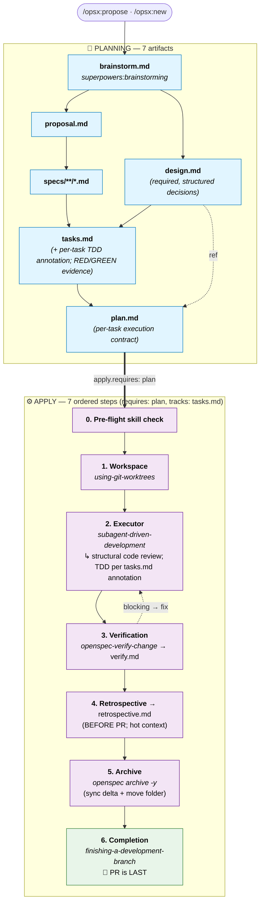

# superpowers-bridge Schema

[English](./README.md) · [繁體中文](./README.zh-TW.md)

[](https://github.com/JiangWay/openspec-schemas/actions/workflows/validate-schemas.yml)
[](https://github.com/JiangWay/openspec-schemas/issues?q=is%3Aopen+label%3Aupstream-version-check)
[](#compatibility)
[](#compatibility)

> Bridges [OpenSpec](https://github.com/Fission-AI/OpenSpec)'s artifact governance (the **what**) with [obra/superpowers](https://github.com/obra/superpowers) execution skills (the **how**) into a single workflow. Adds an evidence-first `retrospective` artifact filling a gap Superpowers does not natively cover.
>
> The integration lives entirely at the prompt layer — no Superpowers source modified, no OpenSpec CLI changes. Schema version: v2 (see [Compatibility](#compatibility) and [Migrating v1 → v2](#migrating-v1--v2)).

---

## Install

### Method 1: Claude Code one-shot prompt (recommended)

Copy and paste this into Claude Code in your project root:

```
Install the superpowers-bridge schema for OpenSpec into this project:

1. Verify the project has an `openspec/` directory (run `openspec init` if missing).
2. Clone https://github.com/JiangWay/openspec-schemas to a temp dir.
3. Copy the `superpowers-bridge/` subdirectory to `openspec/schemas/superpowers-bridge/`.
4. Run `openspec schema validate superpowers-bridge` to verify.
5. Run `openspec schemas` and confirm `superpowers-bridge` is listed.
6. If a CLAUDE.md exists at the project root, ask me whether to insert the workflow-routing fragment from `openspec/schemas/superpowers-bridge/templates/adopters/CLAUDE.md.fragment.<locale>.md` (auto-detect locale from existing CLAUDE.md content; default zh-TW for Traditional Chinese, no suffix for English). If I say yes, append the fragment as a new section. If no CLAUDE.md exists, skip.
7. Clean up the temp directory.
8. Verify Superpowers plugin is installed by running `claude plugin list`.
   If not listed, run `claude plugin install superpowers@claude-plugins-official`.
9. Show me the final state.
```

### Method 2: Manual bash (CI / non-Claude environments)

```bash
git clone https://github.com/JiangWay/openspec-schemas /tmp/oss
cp -R /tmp/oss/superpowers-bridge ~/your-project/openspec/schemas/superpowers-bridge

# Optional: insert workflow-routing fragment into CLAUDE.md
# cat /tmp/oss/superpowers-bridge/templates/adopters/CLAUDE.md.fragment.md       # English
# cat /tmp/oss/superpowers-bridge/templates/adopters/CLAUDE.md.fragment.zh-TW.md # zh-TW

rm -rf /tmp/oss
cd ~/your-project
openspec schema validate superpowers-bridge
claude plugin install superpowers@claude-plugins-official  # if not already
```

---

## Upgrading an existing install

If your project already has `openspec/schemas/superpowers-bridge/` and you want to pull the latest version, use one of the upgrade methods below. The upgrade overwrites the entire `superpowers-bridge/` directory and offers a CLAUDE.md fragment update — see "What the upgrade overwrites" below.

### Upgrade Method 1: Claude Code one-shot prompt (recommended)

In your project root, paste this into Claude Code:

```
Upgrade the superpowers-bridge schema in this project:

1. Verify `openspec/schemas/superpowers-bridge/` already exists (upgrade, not fresh install). If missing, abort and tell me to use the install instructions instead.
2. Clone https://github.com/JiangWay/openspec-schemas to a temp dir.
3. Show me the diff between the local `openspec/schemas/superpowers-bridge/` and the cloned `superpowers-bridge/` (use `diff -ruN`). Wait for my ack before overwriting.
4. After my ack, overwrite the local schema dir with the cloned one.
5. Run `openspec schema validate superpowers-bridge` to verify.
6. Check whether this project has `CLAUDE.md` at the repo root.
   - If yes: scan it for an existing workflow-routing section referencing superpowers-bridge.
     - If found: show me the diff between that section and `superpowers-bridge/templates/adopters/CLAUDE.md.fragment.<locale>.md`. Wait for my ack before replacing.
     - If not found: ask whether to insert the new fragment from `templates/adopters/CLAUDE.md.fragment.<locale>.md`.
   - If no CLAUDE.md exists: skip.
7. Clean up the temp directory.
8. Show me the final state.
```

> `<locale>` defaults to `zh-TW` if your CLAUDE.md is in Traditional Chinese, or no suffix (English). Claude detects from existing CLAUDE.md content.

### Upgrade Method 2: Manual bash

```bash
# 1. Get the latest bundle
git clone https://github.com/JiangWay/openspec-schemas /tmp/oss-upgrade

# 2. Review the diff first (don't overwrite blindly)
diff -ruN ~/your-project/openspec/schemas/superpowers-bridge /tmp/oss-upgrade/superpowers-bridge

# 3. After reviewing, overwrite
rm -rf ~/your-project/openspec/schemas/superpowers-bridge
cp -R /tmp/oss-upgrade/superpowers-bridge ~/your-project/openspec/schemas/superpowers-bridge

# 4. Validate
cd ~/your-project && openspec schema validate superpowers-bridge

# 5. CLAUDE.md fragment (manual)
# View /tmp/oss-upgrade/superpowers-bridge/templates/adopters/CLAUDE.md.fragment.md
# Compare against your CLAUDE.md and insert/update the corresponding section as needed

# 6. Clean up
rm -rf /tmp/oss-upgrade
```

### What the upgrade overwrites

| Path | Action | Manual step? |
|---|---|---|
| `openspec/schemas/superpowers-bridge/` | Auto-overwritten — entire directory replaced from upstream (`rm -rf` + `cp -R` in Method 2; equivalent in Method 1) | None |
| `CLAUDE.md` (project root) | The schema dir ships `templates/adopters/CLAUDE.md.fragment.<locale>.md`; the upgrade procedure diffs your existing CLAUDE.md against this fragment and waits for your ack before inserting / replacing | Yes — review diff, choose insert / replace / keep |

> The bridge directory is monolithic — you take the whole new version or stay on the old one. There is no per-file opt-in. CLAUDE.md is the only project-root file the upgrade ever touches, and never without your ack.

> Within one schema major, in-flight changes (any phase: brainstorm / design / specs / ...) remain valid because the schema graph (`requires:` edges, PRECHECKs, artifact dependencies) does not change across patch releases. Existing `verify.md` / `retrospective.md` from before the upgrade are still readable; if you re-run `/opsx:verify` or `/opsx:continue → retrospective` on them, the new template structure applies on overwrite.

> **Crossing a schema major does need migration.** Upgrading from bundle `1.x.y` (schema major `v1`) to `2.x.y` (schema major `v2`) changes what `tasks.md` and `plan.md` must contain, so an in-flight v1 change needs the steps in [Migrating v1 → v2](#migrating-v1--v2) before it will pass verify. Structural schema-graph changes (artifact add/remove, `requires:` edge changes, PRECHECK changes) are always announced with a migration guide under [Versioning](#versioning).

---

## What problem does this solve?

OpenSpec governs **what to do** (artifact lifecycle: proposal / specs / tasks / verify, etc.). Superpowers governs **how to do it** (execution discipline: brainstorming, planning, TDD, code review). Each is solid on its own; interleaving them in real development surfaces three structural problems:

1. **Output duplication** — brainstorming writes design output to `docs/superpowers/specs/`; OpenSpec re-authors `proposal.md` / `design.md` in the change directory, with overlapping content.
2. **Task fragmentation** — OpenSpec's `tasks.md` (coarse checkboxes) and a Superpowers-style `plan.md` (a step-by-step implementation script) describe the same work in different formats, locations, and progress trackers.
3. **Manual orchestration** — the user has to decide on every step which skill to invoke; the two systems do not connect on their own.

### Why a custom schema rather than modifying existing skills?

Two alternatives were considered and rejected:

- **Adding custom fields to `config.yaml`** (e.g., `skill_bindings`): the OpenSpec CLI does not recognize them — no validation, no discoverability, requires editing multiple SKILL.md files.
- **Editing the opsx skill files directly**: invasive (affects every change) and fragile (overwritten on SKILL.md upgrade).

A custom schema uses OpenSpec's **native project-level schema mechanism**: the CLI validates structure, `openspec schemas` lists it automatically, each change picks its schema independently (`--schema spec-driven` or `--schema superpowers-bridge`), and no existing SKILL.md or command file is modified.

---

## Entry & exit gates

This schema's instructions only fire when invoked through `/opsx:*` commands. If you trigger Superpowers skills via narrative — for example, by saying "let's discuss the architecture" — the default behavior bypasses the schema. Brainstorming will still write to `docs/superpowers/specs/`, defeating the integration's redirection.

This section covers three things:

1. When you don't need to enter the schema at all (just open a PR)
2. When verbal brainstorming should be promoted to an opsx change
3. Front-door anti-patterns to avoid once the schema is installed

### When NOT to enter the schema (direct PR)

Not every change needs a `change` directory. The following scenarios should skip opsx entirely:

| Scenario | Need a change? | What to do |
|---|---|---|
| New feature / new capability | ✅ Yes | `/opsx:new <name> --schema superpowers-bridge` |
| Breaking change | ✅ Yes | Same |
| Architecture change | ✅ Yes | Same |
| Bug fix (restoring intended behavior, no contract change) | ❌ No | Direct PR |
| Test backfill / coverage | ❌ No | Direct PR |
| Build tooling tweak (linter rule, coverage threshold) | ❌ No | Direct PR |
| Non-breaking dependency upgrade | ❌ No | Direct PR |
| Documentation update / typo fix | ❌ No | Direct PR |
| Config value tweak (no structural change) | ❌ No | Direct PR |

> Principle: **process ceremony should scale with risk**. External contracts, cross-system integration, DB schema changes, compliance boundaries → run a change. Typos, bug fixes, timeout adjustments → direct PR. For ambiguous cases, use the 5-condition checklist below.

### When verbal brainstorming should be promoted to a change

If `superpowers:brainstorming` was triggered via narrative ("let's brainstorm the architecture") in a project that uses this schema, the brainstorming output **MUST NOT** land in `docs/superpowers/specs/` — that bypasses the schema's output redirection and creates orphan artifacts.

The correct flow: keep brainstorming verbally until all 5 conditions below hold, then promote to `/opsx:propose` or `/opsx:new` so the agreed design lands in `openspec/changes/<name>/brainstorm.md`.

1. **Scope locked** — one sentence describes what's in / out, and the scope doesn't keep growing each turn
2. **Major design forks resolved** — alternatives have been weighed and one chosen; remaining unknowns are **explicit TBDs** (with owner and impact-scope statement), not "haven't thought about it yet"
3. **Cross-system dependencies mapped** — for each dependency: ready / mockable / genuinely unknown — pick one
4. **Acceptance criteria stateable** — concrete pass conditions (e.g., `./mvnw clean verify` passes + N specific deliverables)
5. **Conversation converging** — the last 1-2 turns are confirmations, not new "what about..." forks

If any condition is missing, keep brainstorming. When all five hold:
- The model **should proactively suggest** "this looks ready for `/opsx:propose` — want to open a change?"
- The user **may also explicitly say** "open this as an opsx change"
- Either way, **promotion requires a deliberate human ack** — never automatic

### Front-door anti-patterns

| Anti-pattern | Why it's wrong |
|---|---|
| Letting brainstorming write to `docs/superpowers/specs/` after the schema is installed | Bypasses redirection at [schema.yaml](./schema.yaml) lines 35-39; produces orphan artifacts |
| Handing the executor a step-by-step implementation script as `plan.md` | `plan.md` is a per-task execution contract — what "done" means for each task, not how to get there (see the `plan` artifact instruction in [schema.yaml](./schema.yaml)). A private decomposition aid may inform it, but its output shape does not define the artifact |
| Promoting to opsx with unresolved blocking TBDs | Those TBDs will block apply phase too — promotion just defers the same problem |
| Opening a change for bug fix / typo / config tweak | Process ceremony exceeds actual risk; slows delivery without value |

---

## Workflow & integration

### Artifact DAG

```text
brainstorm ──┬──→ proposal ──→ specs ──┐
             │                         ├──→ tasks ──→ plan ──→ [apply] ──→ verify ──→ retrospective
             └──→ design ──────────────┘
```

Differences from `spec-driven`:

| | spec-driven | superpowers-bridge |
|---|---|---|
| Entry | proposal (manual) | **brainstorm** (invokes brainstorming skill) |
| Plan layer | tasks (coarse) | tasks (coarse, plus a per-task `TDD:` applicability annotation and RED/GREEN evidence) + **plan** (per-task execution contract) |
| apply requires | tasks | **plan** |
| apply method | standard task-by-task | **worktree + subagent-driven-development** (structural code review; TDD applicability declared per task in `tasks.md`, with RED/GREEN evidence recorded there) |
| Post-apply | (none) | **verify** + **retrospective** artifacts |
| New artifacts | — | brainstorm, plan, verify, retrospective |

### Lifecycle (apply orchestration + timing notes)

The Artifact DAG above shows **file-existence** dependencies. The runtime lifecycle below adds the apply phase's ordered steps and the **timing offsets** between graph edges and actual production order.



ASCII fallback (CLI-readable):

```text
PLANNING ━━━━━━━━━━━━━━━━━━━━━━━━━━━━━━━━━━━━━━━━━━━━━━━━━━━━━━
  brainstorm.md ──┬─→ proposal.md ──→ specs/**/*.md ──┐
                  │                                   ├─→ tasks.md ──→ plan.md
                  └─→ design.md (required) ───────────┘
                                                                       │
                          apply.requires: [plan], apply.tracks: tasks  ▼
APPLY ━━━━━━━━━━━━━━━━━━━━━━━━━━━━━━━━━━━━━━━━━━━━━━━━━━━━━━━━
  0. Pre-flight skill check
  1. superpowers:using-git-worktrees
  2. superpowers:subagent-driven-development (+ structural code review; TDD per tasks.md annotation)
  3. openspec-verify-change → verify.md ◄┐
                              │           │ blocking → fix
                              ▼           │
  4. retrospective.md (BEFORE PR; hot context)
  5. openspec archive -y (sync delta + move folder)
  6. superpowers:finishing-a-development-branch (🏁 PR is LAST)
```

> **Timing notes** (full rationale in "Six design touches" #6):
> - `verify.md` declares `requires: plan` in the graph but is actually produced inside apply step 3.
> - `retrospective.md` declares `requires: verify` and per Step 4 is produced **before** the PR opens — so the PR diff includes the complete archived cycle (all artifacts done, spec synced, change folder under `archive/`).
> - The `requires:` edges are file-existence dependencies for OpenSpec's graph engine; runtime ordering lives in instruction prose.

### Seven Superpowers touchpoints

| # | Superpowers skill | Where it's invoked | Trigger |
|---|---|---|---|
| 1 | `superpowers:brainstorming` | `brainstorm` artifact instruction | Direct (with PRECHECK) |
| 2 | `superpowers:writing-plans` | (not invoked — `plan` is written directly from `tasks.md` / `design.md` / `specs/`; the instruction names the skill only as an optional private decomposition aid) | **Not invoked** |
| 3 | `superpowers:using-git-worktrees` | apply step 1 | Direct |
| 4 | `superpowers:subagent-driven-development` | apply step 2 | Direct |
| 5 | `superpowers:test-driven-development` | (TDD applicability is declared per task in `tasks.md`, and tasks annotated applicable record RED/GREEN evidence there; the schema does not invoke this skill — an implementer may self-trigger it) | **Conditional** |
| 6 | `superpowers:requesting-code-review` | (dispatched by #4; batching possible) | **Structural** |
| 7 | `superpowers:finishing-a-development-branch` | apply step 6 | Direct |

Plus one OpenSpec built-in: `openspec-verify-change` (apply step 3, produces `verify.md`).

> **Naming is not requiring.** This table lists the seven skills the schema **names** in its artifact and apply instructions; `superpowers:executing-plans` is named as well — in the paragraph below, and only in order to rule it out. The schema actually requires and PRECHECKs **four**: `brainstorming` (in the `brainstorm` artifact) and the three in [apply step 0](#0-pre-flight--verify-required-superpowers-skills). Of the rest, `writing-plans` is named only as an optional private aid, and `test-driven-development` / `requesting-code-review` are never invoked by the schema itself.

> **No `executing-plans` fallback.** This schema is opinionated: it requires a subagent-capable platform (Claude Code, Codex, etc.). The alternative executor `superpowers:executing-plans` dispatches no independent reviewer — a single agent executes the plan and self-checks (verified against its [SKILL.md](https://github.com/obra/superpowers/blob/main/skills/executing-plans/SKILL.md)) — and upstream itself directs users to `subagent-driven-development` whenever subagents are available. TDD is not the differentiator: applicability and the RED/GREEN evidence are carried by the `tasks.md` annotations and the evidence contract, whichever executor runs the tasks. If your platform lacks subagent support, use the built-in `spec-driven` schema instead.

### Output redirection

Superpowers skills have default output paths (e.g., brainstorming writes to `docs/superpowers/specs/`). This schema's artifact instructions **override** that behavior by injecting context that redirects output into the change directory:

- brainstorming → `openspec/changes/<name>/brainstorm.md`

Implemented purely via context injection at invocation time, not by modifying skill source.

`plan.md` needs no such redirection: the `plan` artifact is written directly by the agent from `tasks.md`, `design.md` and `specs/`, so no skill produces it and no default output path is in play.

---

## Usage

### Quick flow (recommended)
```bash
/opsx:ff my-feature    # one-shot: scaffold + brainstorm + proposal + design + specs + tasks + plan
/opsx:apply            # worktree + subagent-driven-development (structural code review; TDD per tasks.md annotation)
/opsx:verify           # produces verify.md (12 checks + review judgements)
/opsx:continue         # → retrospective (produces retrospective.md, §0 + 6 sections)
/opsx:archive          # archive
```

### Step-by-step flow
```bash
/opsx:new my-feature --schema superpowers-bridge
/opsx:continue         # → brainstorm (interactive dialogue)
/opsx:continue         # → proposal
/opsx:continue         # → design (reorganize brainstorm into structured decisions)
/opsx:continue         # → specs
/opsx:continue         # → tasks
/opsx:continue         # → plan
/opsx:apply            # → implementation + worktree + subagent-driven-development
/opsx:verify           # → verify.md (post-apply, runs the 12 checks)
/opsx:continue         # → retrospective.md (post-verify, evidence-first §0 + 6 sections)
/opsx:archive
```

### Switching back to spec-driven
```bash
# Use a different schema for one change
/opsx:new my-simple-fix --schema spec-driven

# Or change project default in openspec/config.yaml: schema: spec-driven
```

---

## Apply phase walkthrough

`/opsx:apply` triggers the steps inside [schema.yaml](./schema.yaml)'s `apply.instruction`:

#### 0. Pre-flight — verify required Superpowers skills

Confirms these skills are installed before proceeding:

- `superpowers:using-git-worktrees`
- `superpowers:subagent-driven-development` (dispatches `requesting-code-review`; TDD applicability is declared per task in `tasks.md` and applicable tasks record their RED/GREEN evidence there — `test-driven-development` is neither prechecked nor schema-invoked, though an implementer may self-trigger it)
- `superpowers:finishing-a-development-branch`

Missing skill → STOP with explicit error. No silent fallback, no manual mode within this schema. The user should either install Superpowers or switch to the built-in `spec-driven` schema for that change.

> The v0 version of this schema once placed an "auto-commit change artifacts to current branch" step here. It was removed after the [PR #970 review](https://github.com/Fission-AI/OpenSpec/pull/970): handling untracked change directories is the worktree skill's responsibility, not the schema's.

#### 1. Workspace — `superpowers:using-git-worktrees`

Creates `.worktrees/<change-name>/`, switches to a new branch, runs setup, confirms a clean test baseline.

#### 2. Executor — `superpowers:subagent-driven-development`

Main agent reads `plan.md`, dispatches a fresh subagent per task. Each subagent works from its task's contract entry — what "done" means for that task, not a prescribed sequence of steps:

- **TDD discipline** (via the `tasks.md` annotation): every task carries a `- TDD:` list item under its own checkbox declaring whether TDD applies, and `tasks.md` is the single source of truth for that — a `plan.md` entry may echo it but never redefines it. Every task annotated `TDD: applicable` owes a RED record and a GREEN record under the same checkbox as part of its completion claim. The annotation grammar and the record shape are defined once, in the `tasks` artifact instruction in [schema.yaml](./schema.yaml); the schema does not invoke `superpowers:test-driven-development` itself — an implementer may self-trigger the skill
- **Code review** (`superpowers:requesting-code-review`): structural — reviewer subagents are dispatched during execution (several small same-shape tasks may be batched into one reviewed diff); critical issues normally block forward motion, though upstream lets the controller park a still-open finding after round 5 (see the re-verification table below)

Coarse `tasks.md` checkboxes tick as tasks complete. After all tasks, a final code review covers the whole implementation.

This schema does NOT support `superpowers:executing-plans` as a fallback. See the "Six design touches" section below for rationale.

#### 3. Verification — `openspec-verify-change`

Produces `verify.md` from 12 checks. Checks 1–7 are the cycle-completeness set: structural validation (`openspec validate --all --json`), task completion, delta-spec sync state, design/specs coherence (non-blocking warning), implementation signal (committed code), front-door routing leak detector (non-blocking warning), and deferred-dogfood vs automated-test equivalence. Check 7 blocks only when `plan.md` has `[~]` deferrals but the equivalence section is empty (gap analysis skipped); otherwise it is informational.

Checks 8–12 are the TDD evidence contract and the plan/task key set, added in schema v2. Each **decides its verdict deterministically** — reading text against a fixed rule, with no judgement call — and each blocks on failure: the `TDD:` annotation is present and well-formed on every task (8); every applicable task carries `- RED:` and `- GREEN:` records with their required fields (9); the outcome markers conform, GREEN being exactly `PASS` and RED anything else (10); RED's `subject:` equals GREEN's character for character (11); and the set of `tasks.md` task numbers equals the set of `plan.md` entry keys, compared in both directions (12).

**What checks 8–12 do and do not establish** — the boundary, stated as the schema states it:

- They are deterministic in *what they decide* and **agent-executed** in *how they run*: their execution is the verify agent following the verify instruction. The schema requires them to run before archive and to block on failure, but this is **not** a Harness-level, mechanically enforced, non-bypassable archive-time gate. If the verify agent does not execute one of them, no mechanism in this schema intercepts the omission — review of `verify.md` is the only backstop.
- They read the **presence and structure** of the annotations and records. They do not establish that the evidence is authentic (it is agent-submitted; that assurance rests on the review layer and degrades with it), do not prove a test-first development history, and do not assess semantic quality.
- The semantic questions — whether a RED `failure:` excerpt is a behavioural failure rather than a harness error, whether the cited subject actually tests what the task claims, whether an `n/a` reason holds, and whether an `n/a` task nonetheless carries records — are stated in the instruction as **review judgements** (R1–R4), reported as blocking findings of the review rather than of a check.

Failures route back to the corresponding artifact for fix; verify can be re-run.

> **Steps 4–6 are the canonical post-verify sequence: retro → archive → PR. Reordering produces incomplete PRs (retrospective + archive land as trailing post-merge commits, losing hot context).**

#### 4. Retrospective — `retrospective` artifact (recommended; per Entry & exit gates skip rules, trivial fixes may skip)

Evidence-first reflection: §0 Evidence (quantitative front-matter — commit count, diff size, tasks-done ratio, dependencies, validate state, etc.) plus 6 analysis sections (Wins / Misses / Plan deviations / Skill compliance / Surprises / Promote candidates). Each claim cites a commit / file / measurable fact, typically referencing §0 instead of inlining evidence per bullet. The procedure is embedded in the artifact's instruction — no external skill required (Decision 3 in the design spec defers Claude Code plugin packaging to v1.x).

Written **before** opening the PR so retro lands in the same PR diff.

#### 5. Archive — `openspec archive -y` (or `/opsx:archive`)

Syncs delta specs into `openspec/specs/<capability>/spec.md` and moves the change folder to `openspec/changes/archive/YYYY-MM-DD-<name>/`. Run **before** the PR opens so the diff reflects the complete archived cycle (all artifacts done, spec synced, folder under archive/).

#### 6. Completion — `superpowers:finishing-a-development-branch`

Confirms tests are green, presents merge / PR / keep-branch / discard options, cleans up the worktree. **PR is the last step** — if retro or archive haven't been done, finish them first.

---

## CLI cheat sheet

| Scenario | Command |
|---|---|
| First clone of a project | `bash scripts/install-git-hooks.sh` |
| New change (interactive) | `/opsx:new <name> --schema superpowers-bridge` then `/opsx:continue` |
| New change (one-shot) | `/opsx:ff <name>` |
| Resume an interrupted change | `/opsx:continue <name>` |
| Enter implementation | `/opsx:apply <name>` |
| Manual verify | `/opsx:verify <name>` |
| Archive | `/opsx:archive <name>` |
| Use built-in (skip brainstorm) | `/opsx:new <name> --schema spec-driven` |
| List all schemas in the project | `openspec schemas` |
| Inspect a change's progress | `openspec status --change <name> --json` |
| List active changes | `openspec list` |
| Validate the entire project | `openspec validate --all --json` |

---

## Six design touches worth remembering

### 1. Skill-name PRECHECK (Layer 1 capability detection)

Each artifact / apply step that invokes a Superpowers skill runs a PRECHECK at the start of its instruction, confirming the skill exists in the LLM's available skills list. **Missing skill = STOP, no silent fallback.** This is the concrete answer to layer 1 of [PR #970 review](https://github.com/Fission-AI/OpenSpec/pull/970)'s concern #1 — fail loud, fail early.

### 2. Schema-level vs prompt-level integration

Integration lives entirely in `instruction:` fields (pure prompts). If Superpowers upgrades a skill's behavior, the schema doesn't change. We only touch `schema.yaml` if a skill is renamed or removed.

### 3. How TDD and code review actually arrive — made explicit

TDD and code-review used to be described here as hidden transitive activations of `subagent-driven-development`. Our schema's apply step 2 instruction states the truth explicitly instead — code review is structurally dispatched, and TDD is annotation-driven: applicability is declared per task in `tasks.md`, applicable tasks record RED/GREEN evidence there, and verify's deterministic checks read the presence and structure of both before archive and block on failure. That enforcement is instruction-mediated (an agent following the verify instruction), not a mechanically enforced, non-bypassable gate — so a reader sees what is and is not established during apply at a glance.

### 4. Opinionated: subagent platforms only, no manual fallback

This schema requires a subagent-capable platform (Claude Code, Codex, etc.). The alternative executor `superpowers:executing-plans` dispatches no independent reviewer: a single agent executes the plan and self-checks (verified against its [SKILL.md](https://github.com/obra/superpowers/blob/main/skills/executing-plans/SKILL.md) — its body mentions neither `test-driven-development` nor `requesting-code-review`, and it contains no reviewer dispatch). Upstream itself tells users to prefer `subagent-driven-development` whenever subagents are available. TDD is not what separates the two paths — applicability and the RED/GREEN evidence are carried by the `tasks.md` annotations and the evidence contract, whichever executor runs the tasks. Falling back would silently lose the review structure Superpowers brings to this integration, so we prefer to fail loud at Step 0 and direct users to the built-in `spec-driven` schema instead.

### 5. Evidence-based PRECHECK for verify and retrospective (Layer 2 capability detection)

Each timing-sensitive artifact runs concrete shell evidence checks at the start of its instruction:

- **verify**: `git log <base>..HEAD | wc -l > 0` AND `grep -c '^- \[x\]' tasks.md > 0`
- **retrospective**: `test -f verify.md` AND `! grep -q '^- \[x\] ❌ FAIL' verify.md`

The LLM does not need to interpret timing prose — it runs commands and reads results. This is layer 2 of concern #1 / mitigation for concern #2.

### 6. verify and retrospective are time-mismatched artifacts (known limitation)

`verify.requires: [plan]` and `retrospective.requires: [verify]` are file-existence dependencies in the schema graph, but each instruction explicitly states "MUST run AFTER apply phase / verify pass". This is intentional misalignment — OpenSpec's engine only checks predecessor file existence. Engine-native fix awaits a `post_apply` phase concept upstream (analogous to spec-kit's `after_implement` hook); evidence-based PRECHECK above is the current mitigation.

---

## Versioning

This bundle carries **two version identifiers** that should not be confused:

| Identifier | Where | Meaning | Example |
|---|---|---|---|
| Schema major | `schema.yaml: version: 2` | Contract of the schema graph (artifacts, `requires:` edges, PRECHECK shape). Breaking changes bump this. | `2` |
| Bundle release | `VERSION` file + git tag | SemVer release of this bundle, scoped to a schema major. | `2.0.0` (tag `v2.0.0` at release) |

A bundle release `2.x.y` is a published cut of schema major `v2`, as `1.x.y` was of `v1`. Adopters who pin to a `1.x.y` or `2.x.y` bundle are guaranteed schema-graph compatibility within that major.

> The compatibility matrix below uses the schema major (`v1`, `v2`) as the row key, because compatibility with OpenSpec / Superpowers is governed by the schema contract, not by patch-level edits inside this bundle.

### Why v1 → v2 is a schema-major bump

Two of the policy's criteria are met, and the first is on its own sufficient:

1. **Previously-valid artifacts become invalid.** v2 makes the TDD applicability annotation and the RED/GREEN evidence normative and adds deterministic verification of them (verify checks 8–12). A `tasks.md` that was legal under v1 — no `TDD:` annotations, no records — now fails verification until it is migrated, and a v1 `plan.md` not keyed 1:1 to the task numbers fails check 12. Previously-legal artifacts becoming illegal is what breaking means, independently of any argument about PRECHECKs.
2. **PRECHECK shape changed.** The `plan` artifact's skill PRECHECK is removed, which hits this section's "PRECHECK shape" criterion directly. It is removed because its subject is gone — with `superpowers:writing-plans` no longer a dependency, "is that skill present?" has no object — not because prose replaced it. The replacement control covers a different question: a conforming plan, checked by verify's deterministic checks before archive. Every other PRECHECK (brainstorm, verify, retrospective, apply pre-flight) is untouched.

Keeping `version: 1` and rewording the policy was considered and rejected: that would redefine "breaking" to fit the change and silently break the compatibility promise made to anyone pinned to `v1.x.y`.

### Migrating v1 → v2

For an in-flight change started under a `1.x.y` bundle, after upgrading the schema directory:

1. **`tasks.md`** — add a `- TDD: applicable` or `- TDD: n/a — <reason>` list item under every task checkbox.
2. **Applicable tasks** — record the RED and GREEN evidence under the task in `tasks.md`, per the contract, before running verify.
3. **`plan.md`** — migrate a step-prescribing plan to the Plan Contract shape (one `##` entry per task, keyed by the task number, stating what "done" means), or regenerate it from `tasks.md` + `design.md`.
4. **`superpowers:writing-plans`** — no longer a required dependency; remove it from your install expectations. It stays usable as a private decomposition aid.

The annotation grammar and the record shape are defined once, in the `tasks` artifact instruction in [schema.yaml](./schema.yaml) — read them there rather than from a second copy.

**Rollback:** pin bundle `1.0.1`. Schema major `v1` remains a published cut and is not withdrawn; an unmigrated change keeps working on it.

## Compatibility

Baseline versions this schema was authored against. This is a **historical snapshot, not an end-to-end compatibility guarantee** — CI cannot run the full prompt-layer workflow in headless mode, so behavioral compatibility relies on human review when drift fires.

Current bundle release: **`2.0.0`** (see [VERSION](./VERSION); git tag `v2.0.0` created at release).

| superpowers-bridge | OpenSpec CLI | Superpowers plugin | Baseline as of |
|---|---|---|---|
| v2 | `1.3.1` | `v5.1.0` | 2026-09-01 |
| v1 | `1.3.1` | `v5.1.0` | 2026-05-11 |

> Newest major first. Each major keeps its own row, and the v1 row is retained for adopters still pinned to a `1.x.y` bundle.
>
> The v2 row's OpenSpec entry is a **CLI-level attestation**, not a full prompt-layer cycle: CLI behaviour under `version: 2` was exercised across the CLI surface (validate / schemas / new / status / instructions) against openspec `1.3.1` in an isolated test project on 2026-09-01. The Superpowers entry is **unchanged from v1** — v2 removes a dependency rather than adding one, and no full cycle has been re-run against a newer Superpowers release, so bumping it would claim a check nobody performed. See the re-verification log below for what has and has not been checked against `v6.3.0`.

### Re-verification log

The table above records what this schema was **authored** against; it is not bumped by a partial check. This log records interim re-verifications against newer upstream versions, so the gap between "we looked" and "we re-ran a full cycle" stays visible.

**2026-08-26 — Superpowers `v6.3.0`** (partial re-verification, baseline NOT bumped)

| Check | Result |
|---|---|
| All 8 skills this schema names still exist (`brainstorming`, `writing-plans`, `using-git-worktrees`, `subagent-driven-development`, `finishing-a-development-branch`, `test-driven-development`, `requesting-code-review`, `executing-plans`) | ✅ No renames. **Naming ≠ requiring:** `executing-plans` is named only to be forbidden, and as of v2 `writing-plans` is named only as an optional decomposition aid. **v2 update:** the `plan` artifact's skill PRECHECK was removed with that dependency, so Layer 1 PRECHECK now covers `brainstorming` and the three apply pre-flight skills — those are intact; there is no longer a PRECHECK on `writing-plans` to keep intact |
| Design touch #4's claim that `executing-plans` mentions neither TDD nor code-review | ✅ Still true — 0 matches in its `SKILL.md` |
| `brainstorming` behaves as the `brainstorm` artifact instruction describes | ❌ **Drift — see below** |
| Apply step 2's former claim (removed in bundle 1.0.1) that `subagent-driven-development` transitively enforces `test-driven-development` ("every task follows RED-GREEN-REFACTOR") | ❌ **Was false in v6.3.0 — see below.** The instruction now states the conditional truth |
| Apply step 2's former claim (reworded in bundle 1.0.1) that it transitively enforces `requesting-code-review` | ⚠️ **True, but not per-task.** A review is always dispatched and a final `code-reviewer.md` pass is structural, but `SKILL.md:223-229` directs the controller to batch several small same-shape tasks into ONE dispatch reviewed as a single diff, and `SKILL.md:415-419` lets the controller park a finding it agrees is real once round 5 still leaves it open. So "a fresh reviewer gates every task" overstates it. |
| Full cycle re-run (`/opsx:new` → archive) against v6.3.0 | ⬜ Not done |

**Open drift:** `brainstorming` v6.x opens by classifying the request into three paths — spike / bounded / architectural — and only the architectural path performs the five steps this schema's `brainstorm.instruction` describes. On the spike and bounded paths the skill produces a short in-chat answer and stops, which starves the `design` artifact's Context / Goals / Decisions / Risks / Migration reorganization. Separately, the v6.x skill states that after the architectural path the only skill to invoke next is `writing-plans`, whereas this schema inserts `proposal` → `design` → `specs` → `tasks` in between.

**Resolved in v2 — TDD is conditional upstream (and was never verified as unconditional).** The finding below stands as recorded on 2026-08-26; the fix it points at landed in schema v2. `subagent-driven-development`'s `SKILL.md` (32 KB in v6.3.0) contains no TDD mandate at all; every TDD reference lives in `implementer-prompt.md` and each one is conditional — "Write tests (**following TDD if task says to**)", "Did I follow TDD **if required**?", "**TDD Evidence** (**if TDD was required for this task**)". TDD therefore reaches the implementer only because `writing-plans` bakes "Step 1: Write the failing test / Step 2: Run test to verify it fails" into the tasks it judges to need tests (prose-only work may carry none). Loosening `plan.md` without replacing that channel silently removes TDD. The same prompt already defines a `TDD Evidence` reporting slot (RED command + failing output, GREEN command + passing output), so the fix direction identified at the time was to make the task contract *require* TDD and *demand that evidence*, rather than prescribe the steps.

Status: the false enforcement claim itself was removed in bundle 1.0.1 (apply step 2 now states the conditional truth). **The deeper fix landed in schema v2** — TDD applicability is declared per task in `tasks.md`, applicable tasks record RED/GREEN evidence there, and verify's deterministic checks 8–12 read the presence and structure of both before archive and block on failure (instruction-mediated, not a non-bypassable gate; see [apply step 3](#3-verification--openspec-verify-change) for the full boundary). The bridge no longer depends on `writing-plans` as the TDD channel, so the loosening of `plan.md` no longer removes it.

**Still open:** the `brainstorming` drift above, which needs its own schema change. The Superpowers baseline row stays at `v5.1.0` and the weekly drift issue stays open until it lands.

### How this is checked

The contract is three layers — **baseline declaration + automated drift detection + human review** — not automated compatibility enforcement.

| Layer | Mechanism | Catches | When it fires |
|---|---|---|---|
| Structural | [`validate-schemas.yml`](../.github/workflows/validate-schemas.yml) on every push/PR; [`version-check.yml`](../.github/workflows/version-check.yml) weekly against latest OpenSpec | Schema-graph breaks (field renames, removed `requires:` edges, PRECHECK syntax changes) | CI run fails red |
| Drift notification | [`version-check.yml`](../.github/workflows/version-check.yml) weekly, compares baseline above against latest npm / GitHub release | Pinned ≠ latest upstream | Opens / updates a [labelled drift issue](https://github.com/JiangWay/openspec-schemas/issues?q=is%3Aopen+label%3Aupstream-version-check) for human review (workflow stays green — drift is normal, not a failure) |
| End-to-end workflow | **Not automated** | Behavioral changes inside Superpowers skills (renames, prose rewrites altering PRECHECK semantics, transitive-dependency changes); subtle OpenSpec engine semantic shifts | A human reads upstream release notes when the drift issue fires |

The "Baseline as of" date is bumped when a maintainer manually re-runs a full cycle against the listed versions and confirms nothing degraded. Until then, the date marks human attestation, not an automated test pass. **One exception, stated so the row and this definition do not disagree:** the v2 row's `2026-09-01` is a **CLI-level attestation only** — CLI behaviour under `version: 2` (validate / schemas / new / status / instructions) against openspec `1.3.1` — **not** a full prompt-layer cycle re-run. No full cycle has been re-run since the v1 row's `2026-05-11`.

### Known breaking changes

**v1 → v2** (bundle `1.0.1` → `2.0.0`). The TDD applicability annotation and the RED/GREEN evidence become normative and are verified (checks 8–12), so a `tasks.md` that was valid under v1 fails verification until migrated, and a `plan.md` not keyed 1:1 to the task numbers fails check 12. The `plan` artifact's skill PRECHECK is removed along with the `superpowers:writing-plans` dependency. Migration: [Migrating v1 → v2](#migrating-v1--v2). Rollback: pin bundle `1.0.1`.

Future schema-graph structural changes (artifact add/remove, `requires:` edge changes, PRECHECK changes) will be listed here with a migration note.

For adopters: pin to versions ≥ those listed above. To inspect your own project's runtime state, run `openspec list` + `openspec schemas` + `claude plugin list`.

---

## Design decisions worth knowing

### Why `brainstorm` is an artifact, not a hook

Brainstorming is multi-turn interactive dialogue requiring user participation. Modeling it as the first artifact (rather than a schema-level hook) gives two advantages:

1. **Skippable** — if the user already knows what to build, they can author `brainstorm.md` directly without invoking the skill.
2. **Trackable** — `openspec status` reports brainstorm completion, and downstream artifacts have explicit dependencies on it.

### Why `plan` is separate from `tasks`

`tasks.md` is a coarse checkbox list ("Add PdfServiceTest") that also carries each task's `TDD:` applicability and, for applicable tasks, its RED/GREEN evidence. `plan.md` is a per-task execution contract: one entry per task, keyed by the task number, stating what "done" means for that task. They serve different purposes:

- `tasks.md` → tracks overall progress (apply phase's `tracks` field parses these checkboxes) and is the single source of truth for TDD applicability and evidence
- `plan.md` → tells the executor what each task must deliver and how it will be judged, without prescribing the path (the executor's input)

Apply requires `plan` (not `tasks`) because the executor needs the acceptance criteria per task, not just the checkbox; `tracks: tasks.md` ensures progress is still surfaced via the coarse checkboxes. Because the two files are keyed to each other, verify check 12 compares the task-number set against the entry-key set in both directions.

### Fallback strategy

If a Superpowers skill is unavailable:

- **`brainstorm` artifact** — the user may explicitly opt in to writing the artifact manually (PRECHECK STOPs and informs the user; manual override requires deliberate user action, not silent degradation)
- **`plan` artifact** — not affected. As of v2 it invokes no skill and has no skill PRECHECK: the agent writes it directly from `tasks.md`, `design.md` and `specs/`, so there is nothing to fall back from
- **`apply` phase** — no manual fallback within this schema. PRECHECK STOPs at Step 0 if any required skill is missing. The recommended path is to switch to the built-in `spec-driven` schema for that change. Rationale: see Design touch #4 above — `executing-plans` dispatches no independent reviewer, and a degraded apply phase would defeat the schema's purpose.

---

## Related

- [schema.yaml](./schema.yaml) — machine-readable schema definition
- [templates/](./templates/) — markdown templates per artifact
- [README.zh-TW.md](./README.zh-TW.md) — 繁體中文版
- [obra/superpowers](https://github.com/obra/superpowers) — Superpowers skill source
- [Fission-AI/OpenSpec](https://github.com/Fission-AI/OpenSpec) — OpenSpec
- [OpenSpec PR #970](https://github.com/Fission-AI/OpenSpec/pull/970) — original review thread that drove this design
