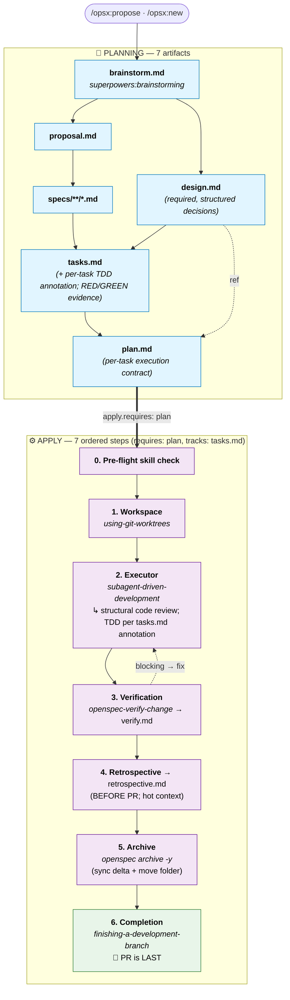

# superpowers-bridge Schema

[English](./README.md) · [繁體中文](./README.zh-TW.md)

[](https://github.com/azuma520/openspec-schemas/actions/workflows/validate-schemas.yml)
[](https://github.com/azuma520/openspec-schemas/issues?q=is%3Aopen+label%3Aupstream-version-check)
[](#compatibility)
[](#compatibility)

> Bridges [OpenSpec](https://github.com/Fission-AI/OpenSpec)'s artifact governance (the **what**) with [obra/superpowers](https://github.com/obra/superpowers) execution skills (the **how**) into a single workflow. Adds an evidence-first `retrospective` artifact filling a gap Superpowers does not natively cover.
>
> The integration lives entirely at the prompt layer — no Superpowers source modified, no OpenSpec CLI changes. Schema version: v4 (see [Compatibility](#compatibility) and [Migrating v3 → v4](#migrating-v3--v4)).

---

## Install

### Method 1: Claude Code one-shot prompt (recommended)

Copy and paste this into Claude Code in your project root:

```
Install the superpowers-bridge schema for OpenSpec into this project:

1. Verify the project has an `openspec/` directory (run `openspec init` if missing).
2. Clone https://github.com/azuma520/openspec-schemas to a temp dir.
3. Copy the `superpowers-bridge/` subdirectory to `openspec/schemas/superpowers-bridge/`.
4. Run `openspec schema validate superpowers-bridge` to verify.
5. Run `openspec schemas` and confirm `superpowers-bridge` is listed.
6. If a CLAUDE.md exists at the project root, ask me whether to insert the workflow-routing fragment from `openspec/schemas/superpowers-bridge/templates/adopters/CLAUDE.md.fragment.<locale>.md` (auto-detect locale from existing CLAUDE.md content; default zh-TW for Traditional Chinese, no suffix for English). If I say yes, append the fragment as a new section. If no CLAUDE.md exists, skip.
7. Clean up the temp directory.
8. Verify Superpowers plugin is installed by running `claude plugin list`.
   If not listed, run `claude plugin install superpowers@claude-plugins-official`.
9. Show me the final state.
```

### Method 2: Manual bash (CI / non-Claude environments)

```bash
git clone https://github.com/azuma520/openspec-schemas /tmp/oss
cp -R /tmp/oss/superpowers-bridge ~/your-project/openspec/schemas/superpowers-bridge

# Optional: insert workflow-routing fragment into CLAUDE.md
# cat /tmp/oss/superpowers-bridge/templates/adopters/CLAUDE.md.fragment.md       # English
# cat /tmp/oss/superpowers-bridge/templates/adopters/CLAUDE.md.fragment.zh-TW.md # zh-TW

rm -rf /tmp/oss
cd ~/your-project
openspec schema validate superpowers-bridge
claude plugin install superpowers@claude-plugins-official  # if not already
```

---

## Upgrading an existing install

If your project already has `openspec/schemas/superpowers-bridge/` and you want to pull the latest version, use one of the upgrade methods below. The upgrade overwrites the entire `superpowers-bridge/` directory and offers a CLAUDE.md fragment update — see "What the upgrade overwrites" below.

### Upgrade Method 1: Claude Code one-shot prompt (recommended)

In your project root, paste this into Claude Code:

```
Upgrade the superpowers-bridge schema in this project:

1. Verify `openspec/schemas/superpowers-bridge/` already exists (upgrade, not fresh install). If missing, abort and tell me to use the install instructions instead.
2. Clone https://github.com/azuma520/openspec-schemas to a temp dir.
3. Show me the diff between the local `openspec/schemas/superpowers-bridge/` and the cloned `superpowers-bridge/` (use `diff -ruN`). Wait for my ack before overwriting.
4. After my ack, overwrite the local schema dir with the cloned one.
5. Run `openspec schema validate superpowers-bridge` to verify.
6. Check whether this project has `CLAUDE.md` at the repo root.
   - If yes: scan it for an existing workflow-routing section referencing superpowers-bridge.
     - If found: show me the diff between that section and `superpowers-bridge/templates/adopters/CLAUDE.md.fragment.<locale>.md`. Wait for my ack before replacing.
     - If not found: ask whether to insert the new fragment from `templates/adopters/CLAUDE.md.fragment.<locale>.md`.
   - If no CLAUDE.md exists: skip.
7. Clean up the temp directory.
8. Show me the final state.
```

> `<locale>` defaults to `zh-TW` if your CLAUDE.md is in Traditional Chinese, or no suffix (English). Claude detects from existing CLAUDE.md content.

### Upgrade Method 2: Manual bash

```bash
# 1. Get the latest bundle
git clone https://github.com/azuma520/openspec-schemas /tmp/oss-upgrade

# 2. Review the diff first (don't overwrite blindly)
diff -ruN ~/your-project/openspec/schemas/superpowers-bridge /tmp/oss-upgrade/superpowers-bridge

# 3. After reviewing, overwrite
rm -rf ~/your-project/openspec/schemas/superpowers-bridge
cp -R /tmp/oss-upgrade/superpowers-bridge ~/your-project/openspec/schemas/superpowers-bridge

# 4. Validate
cd ~/your-project && openspec schema validate superpowers-bridge

# 5. CLAUDE.md fragment (manual)
# View /tmp/oss-upgrade/superpowers-bridge/templates/adopters/CLAUDE.md.fragment.md
# Compare against your CLAUDE.md and insert/update the corresponding section as needed

# 6. Clean up
rm -rf /tmp/oss-upgrade
```

### What the upgrade overwrites

| Path | Action | Manual step? |
|---|---|---|
| `openspec/schemas/superpowers-bridge/` | Auto-overwritten — entire directory replaced from upstream (`rm -rf` + `cp -R` in Method 2; equivalent in Method 1) | None |
| `CLAUDE.md` (project root) | The schema dir ships `templates/adopters/CLAUDE.md.fragment.<locale>.md`; the upgrade procedure diffs your existing CLAUDE.md against this fragment and waits for your ack before inserting / replacing | Yes — review diff, choose insert / replace / keep |

> The bridge directory is monolithic — you take the whole new version or stay on the old one. There is no per-file opt-in. CLAUDE.md is the only project-root file the upgrade ever touches, and never without your ack.

> Within one schema major, in-flight changes (any phase: brainstorm / design / specs / ...) remain valid because the schema graph (`requires:` edges, PRECHECKs, artifact dependencies) does not change across patch releases. Existing `verify.md` / `retrospective.md` from before the upgrade are still readable; if you re-run `/opsx:verify` or `/opsx:continue → retrospective` on them, the new template structure applies on overwrite.

> **Crossing a schema major does need migration.** Upgrading from bundle `1.x.y` (schema major `v1`) to `2.x.y` (schema major `v2`) changed what `tasks.md` and `plan.md` must contain; upgrading from `2.x.y` (`v2`) to `3.x.y` (`v3`) requires every Requirement and Scenario heading to carry a stable ID; upgrading from `3.x.y` (`v3`) to `4.x.y` (`v4`) changes which `plan.md` headings count as entries. An in-flight `v2` change needs the steps in [Migrating v2 → v3](#migrating-v2--v3) before it will pass verify (check 13); an in-flight `v3` change usually needs nothing, apart from the three exceptions listed in [Migrating v3 → v4](#migrating-v3--v4). Any schema-major bump — previously-valid artifacts becoming invalid (independently sufficient), an artifact being added or removed, a `requires:` edge changing, or a PRECHECK's shape changing — is always announced with a migration guide under [Versioning](#versioning).

---

## What problem does this solve?

OpenSpec governs **what to do** (artifact lifecycle: proposal / specs / tasks / verify, etc.). Superpowers governs **how to do it** (execution discipline: brainstorming, planning, TDD, code review). Each is solid on its own; interleaving them in real development surfaces three structural problems:

1. **Output duplication** — brainstorming writes design output to `docs/superpowers/specs/`; OpenSpec re-authors `proposal.md` / `design.md` in the change directory, with overlapping content.
2. **Task fragmentation** — OpenSpec's `tasks.md` (coarse checkboxes) and a Superpowers-style `plan.md` (a step-by-step implementation script) describe the same work in different formats, locations, and progress trackers.
3. **Manual orchestration** — the user has to decide on every step which skill to invoke; the two systems do not connect on their own.

### Why a custom schema rather than modifying existing skills?

Two alternatives were considered and rejected:

- **Adding custom fields to `config.yaml`** (e.g., `skill_bindings`): the OpenSpec CLI does not recognize them — no validation, no discoverability, requires editing multiple SKILL.md files.
- **Editing the opsx skill files directly**: invasive (affects every change) and fragile (overwritten on SKILL.md upgrade).

A custom schema uses OpenSpec's **native project-level schema mechanism**: the CLI validates structure, `openspec schemas` lists it automatically, each change picks its schema independently (`--schema spec-driven` or `--schema superpowers-bridge`), and no existing SKILL.md or command file is modified.

---

## Entry & exit gates

This schema's instructions only fire when invoked through `/opsx:*` commands. If you trigger Superpowers skills via narrative — for example, by saying "let's discuss the architecture" — the default behavior bypasses the schema. Brainstorming will still write to `docs/superpowers/specs/`, defeating the integration's redirection.

This section covers three things:

1. When you don't need to enter the schema at all (just open a PR)
2. When verbal brainstorming should be promoted to an opsx change
3. Front-door anti-patterns to avoid once the schema is installed

### When NOT to enter the schema (direct PR)

Not every change needs a `change` directory. The following scenarios should skip opsx entirely:

| Scenario | Need a change? | What to do |
|---|---|---|
| New feature / new capability | ✅ Yes | `/opsx:new <name> --schema superpowers-bridge` |
| Breaking change | ✅ Yes | Same |
| Architecture change | ✅ Yes | Same |
| Bug fix (restoring intended behavior, no contract change) | ❌ No | Direct PR |
| Test backfill / coverage | ❌ No | Direct PR |
| Build tooling tweak (linter rule, coverage threshold) | ❌ No | Direct PR |
| Non-breaking dependency upgrade | ❌ No | Direct PR |
| Documentation update / typo fix | ❌ No | Direct PR |
| Config value tweak (no structural change) | ❌ No | Direct PR |

> Principle: **process ceremony should scale with risk**. External contracts, cross-system integration, DB schema changes, compliance boundaries → run a change. Typos, bug fixes, timeout adjustments → direct PR. For ambiguous cases, use the 5-condition checklist below.

### When verbal brainstorming should be promoted to a change

If `superpowers:brainstorming` was triggered via narrative ("let's brainstorm the architecture") in a project that uses this schema, the brainstorming output **MUST NOT** land in `docs/superpowers/specs/` — that bypasses the schema's output redirection and creates orphan artifacts.

The correct flow: keep brainstorming verbally until all 5 conditions below hold, then promote to `/opsx:propose` or `/opsx:new` so the agreed design lands in `openspec/changes/<name>/brainstorm.md`.

1. **Scope locked** — one sentence describes what's in / out, and the scope doesn't keep growing each turn
2. **Major design forks resolved** — alternatives have been weighed and one chosen; remaining unknowns are **explicit TBDs** (with owner and impact-scope statement), not "haven't thought about it yet"
3. **Cross-system dependencies mapped** — for each dependency: ready / mockable / genuinely unknown — pick one
4. **Acceptance criteria stateable** — concrete pass conditions (e.g., `./mvnw clean verify` passes + N specific deliverables)
5. **Conversation converging** — the last 1-2 turns are confirmations, not new "what about..." forks

If any condition is missing, keep brainstorming. When all five hold:
- The model **should proactively suggest** "this looks ready for `/opsx:propose` — want to open a change?"
- The user **may also explicitly say** "open this as an opsx change"
- Either way, **promotion requires a deliberate human ack** — never automatic

### Front-door anti-patterns

| Anti-pattern | Why it's wrong |
|---|---|
| Letting brainstorming write to `docs/superpowers/specs/` after the schema is installed | Bypasses redirection at [schema.yaml](./schema.yaml) lines 35-39; produces orphan artifacts |
| Handing the executor a step-by-step implementation script as `plan.md` | `plan.md` is a per-task execution contract — what "done" means for each task, not how to get there (see the `plan` artifact instruction in [schema.yaml](./schema.yaml)). A private decomposition aid may inform it, but its output shape does not define the artifact |
| Promoting to opsx with unresolved blocking TBDs | Those TBDs will block apply phase too — promotion just defers the same problem |
| Opening a change for bug fix / typo / config tweak | Process ceremony exceeds actual risk; slows delivery without value |

---

## Workflow & integration

### Artifact DAG

```text
brainstorm ──┬──→ proposal ──→ specs ──┐
             │                         ├──→ tasks ──→ plan ──→ [apply] ──→ verify ──→ retrospective
             └──→ design ──────────────┘
```

Differences from `spec-driven`:

| | spec-driven | superpowers-bridge |
|---|---|---|
| Entry | proposal (manual) | **brainstorm** (invokes brainstorming skill) |
| Plan layer | tasks (coarse) | tasks (coarse, plus a per-task `TDD:` applicability annotation and RED/GREEN evidence) + **plan** (per-task execution contract) |
| apply requires | tasks | **plan** |
| apply method | standard task-by-task | **worktree + subagent-driven-development** (structural code review; TDD applicability declared per task in `tasks.md`, with RED/GREEN evidence recorded there) |
| Post-apply | (none) | **verify** + **retrospective** artifacts |
| New artifacts | — | brainstorm, plan, verify, retrospective |

### Lifecycle (apply orchestration + timing notes)

The Artifact DAG above shows **file-existence** dependencies. The runtime lifecycle below adds the apply phase's ordered steps and the **timing offsets** between graph edges and actual production order.


```mermaid
flowchart TD
    Start([/opsx:propose · /opsx:new])

    subgraph Plan ["📝 PLANNING — 7 artifacts"]
        direction TB
        BS["<b>brainstorm.md</b><br/><i>superpowers:brainstorming</i>"]
        PROP["<b>proposal.md</b>"]
        DES["<b>design.md</b><br/><i>(required, structured decisions)</i>"]
        SP["<b>specs/**/*.md</b>"]
        TK["<b>tasks.md</b><br/><i>(+ per-task TDD annotation; RED/GREEN evidence)</i>"]
        PL["<b>plan.md</b><br/><i>(per-task execution contract)</i>"]

        BS --> PROP
        BS --> DES
        PROP --> SP
        SP --> TK
        DES --> TK
        TK --> PL
        DES -. ref .-> PL
    end

    subgraph Apply ["⚙️ APPLY — 7 ordered steps (requires: plan, tracks: tasks.md)"]
        direction TB
        A0["<b>0. Pre-flight skill check</b>"]
        A1["<b>1. Workspace</b><br/><i>using-git-worktrees</i>"]
        A2["<b>2. Executor</b><br/><i>subagent-driven-development</i><br/>↳ structural code review; TDD per tasks.md annotation"]
        A3["<b>3. Verification</b><br/><i>openspec-verify-change</i> → verify.md"]
        A4["<b>4. Retrospective</b> → retrospective.md<br/>(BEFORE PR; hot context)"]
        A5["<b>5. Archive</b><br/><i>openspec archive -y</i><br/>(sync delta + move folder)"]
        A6["<b>6. Completion</b><br/><i>finishing-a-development-branch</i><br/>🏁 PR is LAST"]

        A0 --> A1 --> A2 --> A3
        A3 -. blocking → fix .-> A2
        A3 --> A4 --> A5 --> A6
    end

    Start --> BS
    PL ==>|apply.requires: plan| A0

    classDef artifact fill:#e1f5ff,stroke:#0277bd,color:#000
    classDef step fill:#f3e5f5,stroke:#6a1b9a,color:#000
    classDef capstone fill:#e8f5e9,stroke:#2e7d32,color:#000

    class BS,PROP,DES,SP,TK,PL artifact
    class A0,A1,A2,A3,A4,A5 step
    class A6 capstone
```

ASCII fallback (CLI-readable):

```text
PLANNING ━━━━━━━━━━━━━━━━━━━━━━━━━━━━━━━━━━━━━━━━━━━━━━━━━━━━━━
  brainstorm.md ──┬─→ proposal.md ──→ specs/**/*.md ──┐
                  │                                   ├─→ tasks.md ──→ plan.md
                  └─→ design.md (required) ───────────┘
                                                                       │
                          apply.requires: [plan], apply.tracks: tasks  ▼
APPLY ━━━━━━━━━━━━━━━━━━━━━━━━━━━━━━━━━━━━━━━━━━━━━━━━━━━━━━━━
  0. Pre-flight skill check
  1. superpowers:using-git-worktrees
  2. superpowers:subagent-driven-development (+ structural code review; TDD per tasks.md annotation)
  3. openspec-verify-change → verify.md ◄┐
                              │           │ blocking → fix
                              ▼           │
  4. retrospective.md (BEFORE PR; hot context)
  5. openspec archive -y (sync delta + move folder)
  6. superpowers:finishing-a-development-branch (🏁 PR is LAST)
```

> **Timing notes** (full rationale in "Six design touches" #6):
> - `verify.md` declares `requires: plan` in the graph but is actually produced inside apply step 3.
> - `retrospective.md` declares `requires: verify` and per Step 4 is produced **before** the PR opens — so the PR diff includes the complete archived cycle (all artifacts done, spec synced, change folder under `archive/`).
> - The `requires:` edges are file-existence dependencies for OpenSpec's graph engine; runtime ordering lives in instruction prose.

### Seven Superpowers touchpoints

| # | Superpowers skill | Where it's invoked | Trigger |
|---|---|---|---|
| 1 | `superpowers:brainstorming` | `brainstorm` artifact instruction | Direct (with PRECHECK) |
| 2 | `superpowers:writing-plans` | (not invoked — `plan` is written directly from `tasks.md` / `design.md` / `specs/`; the instruction names the skill only as an optional private decomposition aid) | **Not invoked** |
| 3 | `superpowers:using-git-worktrees` | apply step 1 | Direct |
| 4 | `superpowers:subagent-driven-development` | apply step 2 | Direct |
| 5 | `superpowers:test-driven-development` | (TDD applicability is declared per task in `tasks.md`, and tasks annotated applicable record RED/GREEN evidence there; the schema does not invoke this skill — an implementer may self-trigger it) | **Conditional** |
| 6 | `superpowers:requesting-code-review` | (dispatched by #4; batching possible) | **Structural** |
| 7 | `superpowers:finishing-a-development-branch` | apply step 6 | Direct |

Plus one OpenSpec built-in: `openspec-verify-change` (apply step 3, produces `verify.md`).

> **Naming is not requiring.** This table lists the seven skills the schema **names** in its artifact and apply instructions; `superpowers:executing-plans` is named as well — in the paragraph below, and only in order to rule it out. The schema actually requires and PRECHECKs **four**: `brainstorming` (in the `brainstorm` artifact) and the three in [apply step 0](#0-pre-flight--verify-required-superpowers-skills). Of the rest, `writing-plans` is named only as an optional private aid, and `test-driven-development` / `requesting-code-review` are never invoked by the schema itself.

> **No `executing-plans` fallback.** This schema is opinionated: it requires a subagent-capable platform (Claude Code, Codex, etc.). The alternative executor `superpowers:executing-plans` runs with no reviewer per task and reviews the whole branch once at the end; without a subagent tool — exactly where a fallback would run — that final review is performed by the author (verified against its [SKILL.md](https://github.com/obra/superpowers/blob/v6.4.1/skills/executing-plans/SKILL.md), Superpowers v6.4.1–v6.4.2). This schema relies on independent review during execution. TDD is not the differentiator: applicability and the RED/GREEN evidence are carried by the `tasks.md` annotations and the evidence contract, whichever executor runs the tasks. If your platform lacks subagent support, use the built-in `spec-driven` schema instead.

### Output redirection

Superpowers skills have default output paths (e.g., brainstorming writes to `docs/superpowers/specs/`). This schema's artifact instructions **override** that behavior by injecting context that redirects output into the change directory:

- brainstorming → `openspec/changes/<name>/brainstorm.md`

Implemented purely via context injection at invocation time, not by modifying skill source.

`plan.md` needs no such redirection: the `plan` artifact is written directly by the agent from `tasks.md`, `design.md` and `specs/`, so no skill produces it and no default output path is in play.

---

## Usage

### Quick flow (recommended)
```bash
/opsx:ff my-feature    # one-shot: scaffold + brainstorm + proposal + design + specs + tasks + plan
/opsx:apply            # worktree + subagent-driven-development (structural code review; TDD per tasks.md annotation)
/opsx:verify           # produces verify.md (13 checks + review judgements)
/opsx:continue         # → retrospective (produces retrospective.md, §0 + 6 sections)
/opsx:archive          # archive
```

### Step-by-step flow
```bash
/opsx:new my-feature --schema superpowers-bridge
/opsx:continue         # → brainstorm (interactive dialogue)
/opsx:continue         # → proposal
/opsx:continue         # → design (reorganize brainstorm into structured decisions)
/opsx:continue         # → specs
/opsx:continue         # → tasks
/opsx:continue         # → plan
/opsx:apply            # → implementation + worktree + subagent-driven-development
/opsx:verify           # → verify.md (post-apply, runs the 13 checks)
/opsx:continue         # → retrospective.md (post-verify, evidence-first §0 + 6 sections)
/opsx:archive
```

### Switching back to spec-driven
```bash
# Use a different schema for one change
/opsx:new my-simple-fix --schema spec-driven

# Or change project default in openspec/config.yaml: schema: spec-driven
```

---

## Apply phase walkthrough

`/opsx:apply` triggers the steps inside [schema.yaml](./schema.yaml)'s `apply.instruction`:

#### 0. Pre-flight — verify required Superpowers skills

Confirms these skills are installed before proceeding:

- `superpowers:using-git-worktrees`
- `superpowers:subagent-driven-development` (dispatches `requesting-code-review`; TDD applicability is declared per task in `tasks.md` and applicable tasks record their RED/GREEN evidence there — `test-driven-development` is neither prechecked nor schema-invoked, though an implementer may self-trigger it)
- `superpowers:finishing-a-development-branch`

Missing skill → STOP with explicit error. No silent fallback, no manual mode within this schema. The user should either install Superpowers or switch to the built-in `spec-driven` schema for that change.

> The v0 version of this schema once placed an "auto-commit change artifacts to current branch" step here. It was removed after the [PR #970 review](https://github.com/Fission-AI/OpenSpec/pull/970): handling untracked change directories is the worktree skill's responsibility, not the schema's.

#### 1. Workspace — `superpowers:using-git-worktrees`

Creates `.worktrees/<change-name>/`, switches to a new branch, runs setup, confirms a clean test baseline.

#### 2. Executor — `superpowers:subagent-driven-development`

Main agent reads `plan.md`, dispatches a fresh subagent per task. Each subagent works from its task's contract entry — what "done" means for that task, not a prescribed sequence of steps:

- **TDD discipline** (via the `tasks.md` annotation): every task carries a `- TDD:` list item under its own checkbox declaring whether TDD applies, and `tasks.md` is the single source of truth for that — a `plan.md` entry may echo it but never redefines it. Every task annotated `TDD: applicable` owes at least one RED record and one GREEN record under the same checkbox as part of its completion claim — exactly one pair per `subject:`, since a task may carry several subjects. The annotation grammar and the record shape are defined once, in the `tasks` artifact instruction in [schema.yaml](./schema.yaml); the schema does not invoke `superpowers:test-driven-development` itself — an implementer may self-trigger the skill
- **Code review** (`superpowers:requesting-code-review`): structural — reviewer subagents are dispatched during execution (several small same-shape tasks may be batched into one reviewed diff); critical issues normally block forward motion, though upstream lets the controller park a still-open finding after round 5 (see the re-verification table below)

Coarse `tasks.md` checkboxes tick as tasks complete. After all tasks, a final code review covers the whole implementation.

This schema does NOT support `superpowers:executing-plans` as a fallback. See the "Six design touches" section below for rationale.

#### 3. Verification — `openspec-verify-change`

Produces `verify.md` from 13 checks. Checks 1–7 are the cycle-completeness set: structural validation (`openspec validate --all --json`), task completion, delta-spec sync state, design/specs coherence (non-blocking warning), implementation signal (committed code), front-door routing leak detector (non-blocking warning), and deferred-dogfood vs automated-test equivalence. Check 7 reads `tasks.md` and nothing else — under the Plan Contract `tasks.md` is the carrier of task-level state — and blocks only when `tasks.md` carries at least one `- [~]` deferred task line while the equivalence section is empty (gap analysis skipped); otherwise it is informational.

Checks 8–12 are the TDD evidence contract and the plan/task key set, added in schema v2. Each **decides its verdict deterministically** — reading text against a fixed rule, with no judgement call — and each blocks on failure: the `TDD:` annotation is present and well-formed on every task (8); every applicable task carries `- RED:` and `- GREEN:` records with their required fields, and every `subject:` value is well-formed — after trimming, exactly one `::` with a non-empty remainder on each side, and nothing further constrained (no path syntax, no file extension, no test-name character rules) (9); the outcome markers conform, GREEN being exactly `PASS` and RED a single uppercase token other than `PASS` (10); records pair by their `subject:` value and never by position, in two stages — subject values unique within a task on each side, then exactly one RED and exactly one GREEN per subject (11); and the `tasks.md` task numbers correspond 1:1 to the `plan.md` entry keys, also in two stages — no duplicate key on either side, each repeated key named in a message distinct from the missing/extra-key one, then the two key sets compared in both directions (12). In both two-stage checks stage one does **not** short-circuit: stage two is evaluated whatever stage one found, so a single run reports both kinds of defect.

**What checks 8–12 do and do not establish** — the boundary, stated as the schema states it:

- They are deterministic in *what they decide* and **agent-executed** in *how they run*: their execution is the verify agent following the verify instruction. The schema requires them to run before archive and to block on failure, but this is **not** a Harness-level, mechanically enforced, non-bypassable archive-time gate. If the verify agent does not execute one of them, no mechanism in this schema intercepts the omission — review of `verify.md` is the only backstop.
- They decide **structure, format and cardinality** only, and **never** whether the evidence is true. They read the presence and structure of the annotations and records; they do not establish that the evidence is authentic (it is agent-submitted; that assurance rests on the review layer and degrades with it), do not prove a test-first development history, and do not assess semantic quality.
- The semantic questions — whether a RED `failure:` excerpt is a behavioural failure rather than a harness error, whether the cited subject actually tests what the task claims, whether an `n/a` reason holds, and whether an `n/a` task nonetheless carries records — are stated in the instruction as **review judgements** (R1–R4), reported as blocking findings of the review rather than of a check.

**Check 13 (added in schema v3) — identity integrity.** Every Requirement and Scenario heading must carry a stable, unique ID (see [Migrating v2 → v3](#migrating-v2--v3)). Check 13 judges the change's post-archive *candidate state* — produced by an archive preview run in a throwaway copy, never by reasoning about the merge — against that rule, and cross-checks the requirement/scenario counts it reads from text with the OpenSpec CLI's JSON output. It BLOCKs in two distinct kinds that are never collapsed into one: a **violation** (the check completed and found a broken rule) or an **undeterminable** finding (the check could not complete reliably — for example the archive preview failed) — neither kind has a degraded or warning-level pass. Like checks 8–12, it is deterministic in what it decides and agent-executed in how it runs: the schema requires it to run before archive and to block on failure, but this is **not** a Harness-level, non-bypassable gate — if the verify agent skips it, nothing in this schema intercepts the omission. It does not establish that a retired ID is never reassigned, that a scenario ID never silently disappears through a full-text rewrite or through archive, that the meaning under an unchanged ID hasn't weakened, or that an ID survives a capability rename. The full rule set and this claim boundary are owned by the `contract-identity` capability spec ([`openspec/specs/contract-identity/spec.md`](https://github.com/azuma520/openspec-schemas/blob/main/openspec/specs/contract-identity/spec.md) in the openspec-schemas repository — it is not shipped inside this bundle, so a copied `superpowers-bridge/` directory does not contain it) — this README summarizes it and adds nothing.

Failures route back to the corresponding artifact for fix; verify can be re-run.

> **Steps 4–6 are the canonical post-verify sequence: retro → archive → PR. Reordering produces incomplete PRs (retrospective + archive land as trailing post-merge commits, losing hot context).**

#### 4. Retrospective — `retrospective` artifact (recommended; per Entry & exit gates skip rules, trivial fixes may skip)

Evidence-first reflection: §0 Evidence (quantitative front-matter — commit count, diff size, tasks-done ratio, dependencies, validate state, etc.) plus 6 analysis sections (Wins / Misses / Plan deviations / Skill compliance / Surprises / Promote candidates). Each claim cites a commit / file / measurable fact, typically referencing §0 instead of inlining evidence per bullet. The procedure is embedded in the artifact's instruction — no external skill required (Decision 3 in the design spec defers Claude Code plugin packaging to v1.x).

Written **before** opening the PR so retro lands in the same PR diff.

#### 5. Archive — `openspec archive -y` (or `/opsx:archive`)

Syncs delta specs into `openspec/specs/<capability>/spec.md` and moves the change folder to `openspec/changes/archive/YYYY-MM-DD-<name>/`. Run **before** the PR opens so the diff reflects the complete archived cycle (all artifacts done, spec synced, folder under archive/).

#### 6. Completion — `superpowers:finishing-a-development-branch`

Confirms tests are green, presents merge / PR / keep-branch / discard options, cleans up the worktree. **PR is the last step** — if retro or archive haven't been done, finish them first.

---

## CLI cheat sheet

| Scenario | Command |
|---|---|
| First clone of a project | `bash scripts/install-git-hooks.sh` |
| New change (interactive) | `/opsx:new <name> --schema superpowers-bridge` then `/opsx:continue` |
| New change (one-shot) | `/opsx:ff <name>` |
| Resume an interrupted change | `/opsx:continue <name>` |
| Enter implementation | `/opsx:apply <name>` |
| Manual verify | `/opsx:verify <name>` |
| Archive | `/opsx:archive <name>` |
| Use built-in (skip brainstorm) | `/opsx:new <name> --schema spec-driven` |
| List all schemas in the project | `openspec schemas` |
| Inspect a change's progress | `openspec status --change <name> --json` |
| List active changes | `openspec list` |
| Validate the entire project | `openspec validate --all --json` |

---

## Six design touches worth remembering

### 1. Skill-name PRECHECK (Layer 1 capability detection)

Each artifact / apply step that invokes a Superpowers skill runs a PRECHECK at the start of its instruction, confirming the skill exists in the LLM's available skills list. **Missing skill = STOP, no silent fallback.** This is the concrete answer to layer 1 of [PR #970 review](https://github.com/Fission-AI/OpenSpec/pull/970)'s concern #1 — fail loud, fail early.

### 2. Schema-level vs prompt-level integration

Integration lives entirely in `instruction:` fields (pure prompts), so an upstream behavior change does not break the schema structurally — `openspec schema validate` reads no prompt text and keeps passing. But several instructions describe what a Superpowers skill does (how code review and TDD reach the executor, why `executing-plans` is excluded); when that behavior changes, those descriptions must be re-checked against the new release and corrected in `schema.yaml`. A renamed or removed *required* skill is also caught by its PRECHECK; a skill the schema only names (for example `test-driven-development`) is not.

### 3. How TDD and code review actually arrive — made explicit

TDD and code-review used to be described here as hidden transitive activations of `subagent-driven-development`. Our schema's apply step 2 instruction states the truth explicitly instead — code review is structurally dispatched, and TDD is annotation-driven: applicability is declared per task in `tasks.md`, applicable tasks record RED/GREEN evidence there, and verify's deterministic checks read the presence and structure of both before archive and block on failure. That enforcement is instruction-mediated (an agent following the verify instruction), not a mechanically enforced, non-bypassable gate — so a reader sees what is and is not established during apply at a glance. The same instruction carries a freshness requirement: a recorded check result describes the artifacts as they were when the check ran, so editing `tasks.md` or `plan.md` afterwards makes the affected results stale and they must be re-run before archive. That requirement is agent-executed too — nothing here computes or compares a digest of the checked state.

### 4. Opinionated: subagent platforms only, no manual fallback

This schema requires a subagent-capable platform (Claude Code, Codex, etc.). The alternative executor `superpowers:executing-plans` runs with no reviewer per task: it executes every task in one context and reviews the whole branch once at the end — with a fresh reviewer when a subagent tool exists, and by the author when none does (verified against its [SKILL.md](https://github.com/obra/superpowers/blob/v6.4.1/skills/executing-plans/SKILL.md), Superpowers v6.4.1–v6.4.2). A fallback for non-subagent platforms would therefore run with no independent review at all, while this schema relies on independent review during execution — after each task, or each batch of small same-shape tasks. TDD is not what separates the two paths — applicability and the RED/GREEN evidence are carried by the `tasks.md` annotations and the evidence contract, whichever executor runs the tasks. Falling back would silently lose the review structure Superpowers brings to this integration, so we prefer to fail loud at Step 0 and direct users to the built-in `spec-driven` schema instead.

### 5. Evidence-based PRECHECK for verify and retrospective (Layer 2 capability detection)

Each timing-sensitive artifact runs concrete shell evidence checks at the start of its instruction:

- **verify**: `git log <base>..HEAD | wc -l > 0` AND `grep -c '^- \[x\]' tasks.md > 0`
- **retrospective**: `test -f verify.md` AND exactly one of verify.md's three Overall Decision boxes is checked (`grep -cE '^- \[x\] (✅ PASS|⚠️ PASS WITH WARNINGS|❌ FAIL)' verify.md` equals 1) AND `! grep -q '^- \[x\] ❌ FAIL' verify.md`. The count check is what makes it fail-closed: the FAIL grep alone passes a verify.md that recorded no verdict at all

The LLM does not need to interpret timing prose — it runs commands and reads results. This is layer 2 of concern #1 / mitigation for concern #2.

### 6. verify and retrospective are time-mismatched artifacts (known limitation)

`verify.requires: [plan]` and `retrospective.requires: [verify]` are file-existence dependencies in the schema graph, but each instruction explicitly states "MUST run AFTER apply phase / verify pass". This is intentional misalignment — OpenSpec's engine only checks predecessor file existence. Engine-native fix awaits a `post_apply` phase concept upstream (analogous to spec-kit's `after_implement` hook); evidence-based PRECHECK above is the current mitigation.

---

## Versioning

This bundle carries **two version identifiers** that should not be confused:

| Identifier | Where | Meaning | Example |
|---|---|---|---|
| Schema major | `schema.yaml: version: 4` | Contract of the schema graph. Bumps on any breaking change: previously-valid artifacts becoming invalid (independently sufficient), an artifact added/removed, a `requires:` edge changing, or a PRECHECK's shape changing. | `4` |
| Bundle release | `VERSION` file + a same-version Git tag `vX.Y.Z` | SemVer release of this bundle, scoped to a schema major. Each bundle release is marked by an annotated Git tag named `v` plus the exact `VERSION` value, pointing at its release commit; this release discipline is practised from bundle `4.0.0`. | `4.0.0` (tag name `v4.0.0`) |

A bundle release `4.x.y` is a published cut of schema major `v4`, as `3.x.y` was of `v3`, `2.x.y` of `v2` and `1.x.y` of `v1`. Adopters who pin to a `1.x.y`, `2.x.y`, `3.x.y` or `4.x.y` bundle are guaranteed schema-graph compatibility within that major.

The **release commit** is the final commit published to `main` after the change carrying the release has been archived, finally verified and every release-coupled document updated — not necessarily the archive commit. Bundle releases before `4.0.0` carry no Git tags, and none will be created for them retroactively, so a pre-`4.0.0` bundle can be identified only by a commit.

> The compatibility matrix below uses the schema major (`v1`, `v2`, `v3`, `v4`) as the row key, because compatibility with OpenSpec / Superpowers is governed by the schema contract, not by patch-level edits inside this bundle.

### Why v1 → v2 is a schema-major bump

Two of the policy's criteria are met, and the first is on its own sufficient:

1. **Previously-valid artifacts become invalid.** v2 makes the TDD applicability annotation and the RED/GREEN evidence normative and adds deterministic verification of them (verify checks 8–12). A `tasks.md` that was legal under v1 — no `TDD:` annotations, no records — now fails verification until it is migrated, and a v1 `plan.md` not keyed 1:1 to the task numbers fails check 12. Previously-legal artifacts becoming illegal is what breaking means, independently of any argument about PRECHECKs.
2. **PRECHECK shape changed.** The `plan` artifact's skill PRECHECK is removed, which hits this section's "PRECHECK shape" criterion directly. It is removed because its subject is gone — with `superpowers:writing-plans` no longer a dependency, "is that skill present?" has no object — not because prose replaced it. The replacement control covers a different question: a conforming plan, checked by verify's deterministic checks before archive. Every other PRECHECK (brainstorm, verify, retrospective, apply pre-flight) is untouched.

Keeping `version: 1` and rewording the policy was considered and rejected: that would redefine "breaking" to fit the change and silently break the compatibility promise made to anyone pinned to `v1.x.y`.

### Why v2 → v3 is a schema-major bump

One of the policy's criteria is met, and it is on its own sufficient:

1. **Previously-valid artifacts become invalid.** v3 makes a stable ID normative on every Requirement and Scenario heading and adds deterministic verification of it (verify check 13). A `spec.md` that was legal under v2 — a heading with no ID, such as `### Requirement: Token expiry` — now fails verify's check 13 until it is migrated. Previously-legal artifacts becoming illegal is what breaking means, independently of any argument about PRECHECKs.

PRECHECK shape is unaffected this time: check 13 is a new verify check, not a change to any skill PRECHECK, and every existing PRECHECK (brainstorm, apply pre-flight, verify, retrospective) is untouched.

Keeping `version: 2` and only checking newly-written requirements was considered and rejected: that would redefine "breaking" to fit the change, the same reasoning that rejected the equivalent option for v1 → v2 above.

### Why v3 → v4 is a schema-major bump

One of the policy's criteria is met, and it is on its own sufficient:

1. **Previously-valid artifacts become invalid.** v4 defines a `plan.md` entry by a positive rule: a column-0 `##` heading, followed by whitespace, whose text is either the canonical form — `Task`, one or more spaces or tabs, then a number — or the legacy form — the number alone — where the number matches `\d+(\.\d+)*` and is followed by whitespace or the end of the line, outside any column-0 backtick fenced code block. v3 said only that a `##` heading whose text does not begin with a number is not an entry, so a non-entry section headed `## Task 3 notes` was legal under v3; under v4 that heading keys `3`, and a plan with no task `3` now fails verify's check 12. Two further behaviour changes come with the positive rule: `##` heading-shaped lines inside a column-0 backtick fence no longer yield keys, and `##1.1` or an indented ` ## 1.1`, which v3's wording read literally could collect, are no longer entries.

The canonical form exists because Superpowers' `subagent-driven-development` (since `v6.0.0`) extracts a task brief with `scripts/task-brief`, which recognises `Task <number>` headings and does not recognise the v3 form `## 1.1 — …` (S11 in the re-verification log below). The bridge does not change upstream; it accepts a form that upstream recognises. No artifact is added or removed, no `requires:` edge changes, and every PRECHECK is untouched.

Keeping `version: 3` was rejected for the same reason as in the two bumps above: it would redefine "breaking" to fit the change.

### Migrating v3 → v4

Existing plans generally need no migration: the legacy entry heading `## <number> — …` is still valid, with no scheduled removal, and the two forms may be mixed in one plan. The canonical form `## Task <number> — …` is recommended for new or edited plans. The same number in both forms is the same key, so `## Task 1.1` and `## 1.1` in one plan are a repeated key. The entry rule, and the guidance for plans handed to upstream `task-brief`, are defined once, in the `plan` artifact instruction in [schema.yaml](./schema.yaml).

Three exceptions need checking:

1. **A non-entry `##` heading of the form `Task <number>`** — at column 0, the word `Task`, one or more spaces or tabs, then a number matching `\d+(\.\d+)*` followed by whitespace or the end of the line (for example `## Task 3 notes`): v4 reads it as an entry, so rename it. `## Task 3a notes`, `## Task3 notes` and `### Task 3 notes` stay non-entries.
2. **`##` headings inside a column-0 backtick fenced code block**: check 12 now skips them, so a plan that passed (or was blocked) only because of a heading inside such a block gets a different verdict. A `~~~` fence or an indented fence hides nothing.
3. **An entry heading must start at column 0, and `##` must be followed by whitespace**: `##1.1` or an indented ` ## 1.1`, which v3's wording read literally could accept, is no longer an entry.

This repository's `plan.md` files were checked for all three, and none occurs outside the mutation fixtures that exercise these cases on purpose.

For an in-flight change started under a `3.x.y` bundle: upgrade the bundle to `4.0.0`, check its `plan.md` for the three exceptions above, then run verify.

**Rollback:** check out commit `V3_ROLLBACK_SHA_PLACEHOLDER` — the parent of the first commit that sets `schema.yaml` to `version: 4` — and copy its `superpowers-bridge/` directory into `openspec/schemas/`. Bundles before `4.0.0` carry no tags, so the rollback names a commit rather than a bundle version. Schema major `v3` remains a published cut and is not withdrawn.

### Migrating v2 → v3

A Requirement heading now takes the form `### Requirement: <REQ-ID> <description>`, and a Scenario heading `#### Scenario: <REQ-ID>-S<m> <description>`; a newly-allocated Requirement ID looks like `REQ-<n>` (a positive integer). The full grammar and the new-ID allocation rule are defined once, in the `contract-identity` capability spec ([`openspec/specs/contract-identity/spec.md`](https://github.com/azuma520/openspec-schemas/blob/main/openspec/specs/contract-identity/spec.md) in the openspec-schemas repository — it is not shipped inside this bundle, so a copied `superpowers-bridge/` directory does not contain it) — read them there rather than from a second copy.

For an in-flight change started under a `2.x.y` bundle, after upgrading the schema directory:

1. **Upgrade the bundle** to `3.0.0`.
2. **Open one renumbering change that covers every capability.** For each capability's main spec: give every Requirement that has no stable ID yet a new one via a `RENAMED` entry (a Requirement that already carries a stable ID keeps it and needs no `RENAMED` entry), then update the heading text via `MODIFIED` with the new heading. Scenarios do not go through `RENAMED` — each gets its `<REQ-ID>-S<m>` ID as part of that same `MODIFIED` full-text replacement, since a Scenario heading is not itself a renameable entry. Content does not change — only the headings. **This cannot be split across capabilities into separate changes**: check 13 judges the *candidate state* — every main spec the change's archive would produce, not only the ones it touches — so a change that renumbers only some capabilities is blocked by every capability it left unnumbered.
3. **Run verify** (check 13 included) and then archive.
4. **Any other in-flight `v2` change not yet archived** needs its delta specs' new and modified headings brought up to the ID grammar above before it will pass verify. Once the renumbering change is archived, every `MODIFIED` / `REMOVED` heading and every `RENAMED` `FROM` heading in those changes must also be updated to the numbered heading the migration produced — otherwise the archive preview fails (`not found`), check 13 records an undeterminable finding, and the real archive aborts.

**Rollback:** pin bundle `2.x.y`. Schema major `v2` remains a published cut and is not withdrawn; IDs added during a partial migration are harmless under `v2` — it does not check IDs, and an ID-bearing heading validates and archives normally under the CLI.

### Migrating v1 → v2

For an in-flight change started under a `1.x.y` bundle, after upgrading the schema directory:

1. **`tasks.md`** — add a `- TDD: applicable` or `- TDD: n/a — <reason>` list item under every task checkbox.
2. **Applicable tasks** — record the RED and GREEN evidence under the task in `tasks.md`, per the contract, before running verify.
3. **`plan.md`** — migrate a step-prescribing plan to the Plan Contract shape (one `##` entry per task, keyed by the task number, stating what "done" means), or regenerate it from `tasks.md` + `design.md`.
4. **`superpowers:writing-plans`** — no longer a required dependency; remove it from your install expectations. It stays usable as a private decomposition aid.

The annotation grammar and the record shape are defined once, in the `tasks` artifact instruction in [schema.yaml](./schema.yaml) — read them there rather than from a second copy.

**Rollback:** pin bundle `1.0.1`. Schema major `v1` remains a published cut and is not withdrawn; an unmigrated change keeps working on it.

## Compatibility

Baseline versions this schema was authored against. This is a **historical snapshot, not an end-to-end compatibility guarantee** — CI cannot run the full prompt-layer workflow in headless mode, so behavioral compatibility relies on human review when drift fires.

Current bundle release: **`4.0.0`** (see [VERSION](./VERSION)). Each bundle release is marked by a same-version Git tag `vX.Y.Z`; this release discipline is practised from bundle `4.0.0`.

| superpowers-bridge | OpenSpec CLI | Superpowers plugin | Baseline as of |
|---|---|---|---|
| v4 | `1.14.0` | `v5.1.0` | pending |
| v3 | `1.14.0` | `v5.1.0` | 2026-10-02 |
| v2 | `1.3.1` | `v5.1.0` | 2026-09-01 |
| v1 | `1.3.1` | `v5.1.0` | 2026-05-11 |

> Newest major first. Each major keeps its own row, and the v1, v2 and v3 rows are retained for adopters still pinned to a `1.x.y`, `2.x.y` or `3.x.y` bundle.
>
> **The v4 row's Superpowers entry (`v5.1.0`) is a historical declaration carried forward without revalidation — it is not a compatibility guarantee.** No full cycle has been re-run against `v5.1.0` since v2; the bridge currently has no external adopters, and no further investment in revalidating `v5.1.0` is planned. The value stays in the cell, with this explanation below the table rather than inside it, because the weekly version check reads that cell as a version. The environment known to have been exercised by the PoC for this change is Superpowers `v6.4.1`; this change's dogfood records the Superpowers version it actually loaded, and the row must not be described as fully verified until a full verification has been done. The OpenSpec entry `1.14.0` is carried over from the v3 row. The **Baseline as of** cell reads `pending`: it is filled only with the date a maintainer re-runs a full cycle against the versions listed in this row and confirms nothing degraded, and a run against any other version — this change's dogfood on the Superpowers version it actually loaded included — is not grounds to fill it.
>
> **The v3 row declares the same Superpowers baseline as v1 and v2 (`v5.1.0`, unbumped) — v3 does not touch the Superpowers dependency any more than v2 did, and the `brainstorming` drift recorded in the re-verification log below is still open. The environment actually exercised while implementing this change is recorded separately below, distinct from that declared baseline.** OpenSpec `1.14.0` (bumped from `1.3.1` on 2026-10-02): **OpenSpec `1.14.0` has completed a CLI-level compatibility confirmation** — not a full workflow run; see the 2026-10-02 re-verification entry below. Earlier, under OpenSpec `1.3.1`: `openspec schema validate superpowers-bridge` passed against the v3 schema in throwaway test-project copies while implementing the `requirement-scenario-identity` change, and the 22 identity mutation fixtures were run through `openspec validate` / `openspec archive` / `openspec show` — all under CLI `1.3.1`. **Observed environment, not the declared baseline:** the `requirement-scenario-identity` change's own apply phase — and only the paths it exercised, loading the `using-git-worktrees` and `subagent-driven-development` skills — ran on the installed Superpowers `v6.4.1` and passed. This is not a full `/opsx:new` → archive cycle; it does not cover that change's own brainstorm or design phases, which ran earlier under an unrecorded Superpowers version; and it does not by itself justify raising the declared baseline — that requires a full compatibility verification after the `brainstorming` drift fix lands. See the re-verification log below for the still-open `v6.3.0` findings, which this row does not resolve.
>
> The v2 row's OpenSpec entry is a **CLI-level attestation**, not a full prompt-layer cycle: CLI behaviour under `version: 2` was exercised across the CLI surface (validate / schemas / new / status / instructions) against openspec `1.3.1` in an isolated test project on 2026-09-01. The Superpowers entry is **unchanged from v1** — v2 removes a dependency rather than adding one, and no full cycle has been re-run against a newer Superpowers release, so bumping it would claim a check nobody performed. See the re-verification log below for what has and has not been checked against `v6.3.0`.

### Re-verification log

The table above records the upstream versions this schema is declared compatible with. A baseline is not bumped by scattered spot checks, or by a partial check too thin to carry a compatibility claim. It may be bumped once the scope of the claim is stated explicitly and the dependency surface inside that scope has been re-verified enough to support it — the 2026-10-02 OpenSpec `1.14.0` bump below is scoped that way (CLI level, not a full agent workflow). The Superpowers baseline is bumped only after a full cycle is re-run, because the bridge depends on Superpowers through skill behaviour rather than a CLI surface. This log records interim re-verifications against newer upstream versions, so the gap between "we looked" and "we re-ran a full cycle" stays visible.

**2026-08-26 — Superpowers `v6.3.0`** (partial re-verification, baseline NOT bumped)

| Check | Result |
|---|---|
| All 8 skills this schema names still exist (`brainstorming`, `writing-plans`, `using-git-worktrees`, `subagent-driven-development`, `finishing-a-development-branch`, `test-driven-development`, `requesting-code-review`, `executing-plans`) | ✅ No renames. **Naming ≠ requiring:** `executing-plans` is named only to be forbidden, and as of v2 `writing-plans` is named only as an optional decomposition aid. **v2 update:** the `plan` artifact's skill PRECHECK was removed with that dependency, so Layer 1 PRECHECK now covers `brainstorming` and the three apply pre-flight skills — those are intact; there is no longer a PRECHECK on `writing-plans` to keep intact |
| Design touch #4's claim that `executing-plans` mentions neither TDD nor code-review | ✅ Still true — 0 matches in its `SKILL.md` |
| `brainstorming` behaves as the `brainstorm` artifact instruction describes | ❌ **Drift — see below** |
| Apply step 2's former claim (removed in bundle 1.0.1) that `subagent-driven-development` transitively enforces `test-driven-development` ("every task follows RED-GREEN-REFACTOR") | ❌ **Was false in v6.3.0 — see below.** The instruction now states the conditional truth |
| Apply step 2's former claim (reworded in bundle 1.0.1) that it transitively enforces `requesting-code-review` | ⚠️ **True, but not per-task.** A review is always dispatched and a final `code-reviewer.md` pass is structural, but `SKILL.md:223-229` directs the controller to batch several small same-shape tasks into ONE dispatch reviewed as a single diff, and `SKILL.md:415-419` lets the controller park a finding it agrees is real once round 5 still leaves it open. So "a fresh reviewer gates every task" overstates it. |
| Full cycle re-run (`/opsx:new` → archive) against v6.3.0 | ⬜ Not done |

**Open drift:** `brainstorming` v6.x opens by classifying the request into three paths — spike / bounded / architectural — and only the architectural path performs the five steps this schema's `brainstorm.instruction` describes. On the spike and bounded paths the skill produces a short in-chat answer and stops, which starves the `design` artifact's Context / Goals / Decisions / Risks / Migration reorganization. Separately, the v6.x skill states that after the architectural path the only skill to invoke next is `writing-plans`, whereas this schema inserts `proposal` → `design` → `specs` → `tasks` in between.

**Resolved in v2 — TDD is conditional upstream (and was never verified as unconditional).** The finding below stands as recorded on 2026-08-26; the fix it points at landed in schema v2. `subagent-driven-development`'s `SKILL.md` (32 KB in v6.3.0) contains no TDD mandate at all; every TDD reference lives in `implementer-prompt.md` and each one is conditional — "Write tests (**following TDD if task says to**)", "Did I follow TDD **if required**?", "**TDD Evidence** (**if TDD was required for this task**)". TDD therefore reaches the implementer only because `writing-plans` bakes "Step 1: Write the failing test / Step 2: Run test to verify it fails" into the tasks it judges to need tests (prose-only work may carry none). Loosening `plan.md` without replacing that channel silently removes TDD. The same prompt already defines a `TDD Evidence` reporting slot (RED command + failing output, GREEN command + passing output), so the fix direction identified at the time was to make the task contract *require* TDD and *demand that evidence*, rather than prescribe the steps.

Status: the false enforcement claim itself was removed in bundle 1.0.1 (apply step 2 now states the conditional truth). **The deeper fix landed in schema v2** — TDD applicability is declared per task in `tasks.md`, applicable tasks record RED/GREEN evidence there, and verify's deterministic checks 8–12 read the presence and structure of both before archive and block on failure (instruction-mediated, not a non-bypassable gate; see [apply step 3](#3-verification--openspec-verify-change) for the full boundary). The bridge no longer depends on `writing-plans` as the TDD channel, so the loosening of `plan.md` no longer removes it.

**Still open:** the `brainstorming` drift above, which needs its own schema change. The Superpowers baseline row stays at `v5.1.0` and the weekly drift issue stays open until it lands.

**2026-10-02 — OpenSpec `1.14.0`: CLI-level compatibility confirmed** (OpenSpec baseline bumped from `1.3.1`)

All 24 OpenSpec dependencies the bridge has (enumerated in the [issue #2 compatibility spike report](https://github.com/azuma520/openspec-schemas/blob/main/docs/superpowers/poc/2026-10-02-issue2-compat-spike/report.md), O1–O24) were each checked against openspec `1.3.1` and `1.14.0`: **16 hold, 8 changed and need evaluation, 0 broken.** The evidence is mixed, not 24 symmetric runs: 20 items (O1–O10, O13, O14, O17–O24) were exercised on both versions with the same fixture project; O15 was exercised on `1.14.0` only (the same case never reached that check on `1.3.1`); O11, O12 and O16 were checked by reading sources (the changelog, the skills `openspec init` generates, and source comments). "Changed" means the CLI now behaves differently; none of the 8 currently makes a bridge dependency fail. The `instruction` of four artifacts — brainstorm, plan, verify and retrospective — reached the agent byte-for-byte on both versions; `apply.instruction` was confirmed byte-for-byte only on `1.14.0`, in the `ready` state (on `1.3.1` the same fixture returned the `all_done` hint instead of that instruction). No JSON field the bridge reads was removed. The baseline bump rests on this CLI-level re-verification of the surface the bridge depends on; it does not claim that a full agent workflow has been run under `1.14.0` (see the evidence boundary below).

| Spike item | What changed in `1.14.0` | Where it touches the bridge |
|---|---|---|
| O9 | `- [~]` (deferred task) is now counted as **unfinished** (since `1.13.1`): `openspec list` shows `2/3 tasks`, `instructions apply` lists it as `- [ ]`, and `archive -y` warns `1 incomplete task(s)` and continues | verify check 2 and check 7 define `[~]` as not failing; the CLI no longer agrees |
| O12 | The generated `openspec-verify-change` skill reads the CLI's task progress and reports every remaining task — a `[~]` one included — as CRITICAL ("Must fix before archive") | The verify artifact invokes this skill and then runs its own checks, so a change with `[~]` gets two opposite verdicts on the same task |
| O15 | A scenario written at level 3 is now reported (INFO plus ERROR "must include at least one scenario", exit 1) | `schema.yaml`'s "Using 3 hashtags or bullets will fail silently" no longer describes `1.14.0` (the `1.3.1` behaviour was not compared) |
| O18 | An aborted archive now exits **1** (it exited 0 under `1.3.1`) and leaves an empty `changes/archive/` behind | Check 13.B's three-condition success test still classifies the preview correctly; its "openspec 1.3.1 exits 0" sentence is now version-specific |
| O19 | An ADDED requirement already synced with identical text is now a no-op, so that archive preview succeeds | The observed example in check 13.B (preview aborts with `already exists`) no longer reproduces; the SYNCED CAPABILITY rule does not depend on it |
| O20 | `show <capability> --type spec --json` adds a `name` to every requirement and scenario; counts are unchanged | Check 13.E's "the CLI emits no heading text, so pairing is by position" is no longer true (positional pairing still works) |
| O21 | `show <change> --json --deltas-only` no longer writes the `Ignoring flags … scenarios` warning to stderr; fields unchanged (plus `name`) | Check 13.E's stderr note describes `1.3.1` only; reading stdout alone stays correct |
| O24 | With artifacts up to `plan` written, `openspec status` ends with `Next: openspec instructions verify …` | Design touch #6 (verify is produced after apply) — the CLI now actively suggests the wrong order; verify's evidence PRECHECK still stops it |

**Evidence boundary.** This is a CLI-level confirmation only: the commands were run in an isolated test project with the bridge copied in, on Windows. No agent ran a full `/opsx:new` → archive cycle under `1.14.0`, the 22 identity mutation fixtures were not re-run against `1.14.0`, and the prompt-layer items (for example O12) were judged by reading the generated skills, not by running them.

**2026-10-02 — Superpowers `v6.4.2`** (partial re-verification, baseline NOT bumped)

The same spike checked the bridge's 18 Superpowers dependencies against `v6.4.2`: 8 hold, 3 changed, 1 unverified, 6 no longer hold. Among the skills this schema names, the installed `v6.4.1` differs from `v6.4.2` only in `writing-plans`. The six that no longer hold:

| Spike item | Bridge statement | Result against `v6.4.2` |
|---|---|---|
| S4 | `brainstorming` runs the five steps listed in the `brainstorm` instruction | ❌ Three paths (spike / bounded / architectural); only architectural runs those steps, and `v6.4.1` added an intent check and a HARD-GATE in front of them. This is the open drift above, deepened |
| S5 | `brainstorming` hands off into `proposal` → `design` → `specs` → `tasks` | ❌ Architectural may hand off only to `writing-plans`; bounded proceeds **directly to implementation** with no plan document |
| S11 | `subagent-driven-development` can execute this schema's `plan.md` | ❌ Its `scripts/task-brief` delimits tasks with the regex `^#+[ \t]+Task[ \t]+[0-9]+` (per the locally installed `v6.4.1` source) — a `Task N` heading at any `#` level, which also matches `## Task 1.1a` [corrected in schema v4: the 2026-10-02 wording, "only matches `## Task N` headings", was narrower than this regex]; a Plan Contract entry `## 1.1 — …` returns exit 3 (since `v6.0.0`; already met while dogfooding and worked around by a controller ruling). **Addressed for recognition in schema v4:** the Plan Contract accepts the canonical form `## Task 1.1 — …`, which `task-brief` recognises; the legacy form stays accepted by the bridge and is still not recognised by `task-brief`, and the range `task-brief` extracts for an entry is not guaranteed correct |
| S12 | `finishing-a-development-branch` offers merge / PR / keep / discard and cleans up the worktree | ❌ Three options only; discard happens only on an explicit request, and the PR option keeps the worktree |
| S13 | `executing-plans` dispatches no independent reviewer and mentions neither TDD nor code review | ❌ Rebuilt in `v6.4.1`: it loads `test-driven-development` and dispatches one fresh whole-branch review at the end (still no per-task reviewer). This supersedes the 2026-08-26 "✅ Still true" row above |
| S14 | Upstream directs users to `subagent-driven-development` whenever subagents are available | ❌ The plan handoff now offers Subagent-driven and Native (inline) execution as a choice |

**Why the baseline stays at `v5.1.0`:** S4, S5, S13 and S14 are statements in this schema's own instruction text or its stated rationale, so bumping the baseline would re-assert them; correcting them changes `schema.yaml` and goes through its own change. Two follow-ups are registered: rewrite the rationale for refusing `executing-plans` as a fallback, and resolve the `task-brief` heading-format gap. Addressing S11 (see the follow-up status below) does not move the baseline either: S4, S5, S12 and S14 are still not aligned.

**Follow-up status (2026-10-06):** the first follow-up is done — the `executing-plans` rationale was corrected to match current upstream behavior by change `fix-executing-plans-rationale`. The `task-brief` heading-format gap was still open on that date.

**Follow-up status (schema v4, bundle `4.0.0`):** the second follow-up is addressed by change `task-prefixed-plan-headings` — for **recognition only**. A plan whose entries use the canonical form `## Task <number> — …` has every entry recognised by `task-brief`; this does not make the range `task-brief` extracts for an entry correct, and the `plan` instruction's guidance for plans handed to `task-brief` claims recognition only as well. The legacy form `## <number> — …` stays valid in the bridge and is still not recognised by `task-brief`.

Full method, per-item evidence and what was not checked: [issue #2 compatibility spike report](https://github.com/azuma520/openspec-schemas/blob/main/docs/superpowers/poc/2026-10-02-issue2-compat-spike/report.md) (in the openspec-schemas repository; not shipped inside this bundle).

### How this is checked

The contract is three layers — **baseline declaration + automated drift detection + human review** — not automated compatibility enforcement.

| Layer | Mechanism | Catches | When it fires |
|---|---|---|---|
| Structural | [`validate-schemas.yml`](../.github/workflows/validate-schemas.yml) on every push/PR; [`version-check.yml`](../.github/workflows/version-check.yml) weekly against latest OpenSpec | Structural errors the OpenSpec schema validator reports — e.g. a `requires:` entry naming an artifact that does not exist, or a dependency cycle. **Not caught** (verified 2026-10-01): a removed `requires:` edge, a misspelled key such as `requirez:`, and any change to `instruction:` text including PRECHECK — those need human review | CI run fails red |
| Drift notification | [`version-check.yml`](../.github/workflows/version-check.yml) weekly, compares baseline above against latest npm / GitHub release | Pinned ≠ latest upstream | Opens / updates a [labelled drift issue](https://github.com/azuma520/openspec-schemas/issues?q=is%3Aopen+label%3Aupstream-version-check) for human review (workflow stays green — drift is normal, not a failure) |
| End-to-end workflow | **Not automated** | Behavioral changes inside Superpowers skills (renames, prose rewrites altering PRECHECK semantics, transitive-dependency changes); subtle OpenSpec engine semantic shifts | A human reads upstream release notes when the drift issue fires |

The "Baseline as of" date is bumped when a maintainer manually re-runs a full cycle against the listed versions and confirms nothing degraded. Until then, the date marks human attestation, not an automated test pass; the v4 row's `pending` means no such run has been made against that row's versions yet. **Two exceptions, stated so the rows and this definition do not disagree:** the v2 row's `2026-09-01` and the v3 row's `2026-10-02` are each a **CLI-level attestation only** — CLI behaviour under the row's `version:` (for v2, validate / schemas / new / status / instructions against openspec `1.3.1`; for v3, `schema validate` plus the 22 identity mutation fixtures under `validate` / `archive` / `show` against openspec `1.3.1` on 2026-09-30, then the bridge's CLI surface — `schema validate` / `schemas` / `new change` / `status` / `instructions` / `validate` / `show` / `archive` — against openspec `1.14.0` on 2026-10-02, without re-running those fixtures) — **not** a full prompt-layer cycle re-run. Neither date reflects a Superpowers re-verification: the Superpowers column is unbumped in both rows, and the environment `requirement-scenario-identity` actually exercised (Superpowers `v6.4.1`, apply phase only) is recorded above as an observation distinct from the declared baseline, not as grounds to move this date. No full cycle has been re-run since the v1 row's `2026-05-11`.

### Known breaking changes

**v3 → v4** (bundle `3.0.0` → `4.0.0`). A `plan.md` entry is now defined by a positive rule that accepts the canonical form `## Task <number> — …` beside the legacy `## <number> — …`. Three behaviour changes can alter a v3 plan's check-12 verdict: a non-entry column-0 `##` heading of the form `Task <number>` — the word `Task`, one or more spaces or tabs, then a number matching `\d+(\.\d+)*` followed by whitespace or the end of the line becomes an entry; `##` headings inside a column-0 backtick fenced code block no longer yield keys; and `##1.1` or an indented ` ## 1.1` is no longer an entry. Migration: [Migrating v3 → v4](#migrating-v3--v4). Rollback: check out commit `V3_ROLLBACK_SHA_PLACEHOLDER` (the parent of the first commit that sets `version: 4`); no `3.x.y` tag exists to pin.

**v2 → v3** (bundle `2.0.0` → `3.0.0`). Every Requirement and Scenario heading must now carry a stable ID, verified by check 13: a `spec.md` legal under v2 — an unnumbered heading — fails verification until migrated. Migration: [Migrating v2 → v3](#migrating-v2--v3). Rollback: pin bundle `2.x.y`.

**v1 → v2** (bundle `1.0.1` → `2.0.0`). The TDD applicability annotation and the RED/GREEN evidence become normative and are verified (checks 8–12), so a `tasks.md` that was valid under v1 fails verification until migrated, and a `plan.md` not keyed 1:1 to the task numbers fails check 12. The `plan` artifact's skill PRECHECK is removed along with the `superpowers:writing-plans` dependency. Migration: [Migrating v1 → v2](#migrating-v1--v2). Rollback: pin bundle `1.0.1`.

Future schema-major bumps — whether from previously-valid artifacts becoming invalid, an artifact being added or removed, a `requires:` edge changing, or a PRECHECK's shape changing — will be listed here with a migration note.

For adopters: pin to versions ≥ those listed above. To inspect your own project's runtime state, run `openspec list` + `openspec schemas` + `claude plugin list`.

---

## Design decisions worth knowing

### Why `brainstorm` is an artifact, not a hook

Brainstorming is multi-turn interactive dialogue requiring user participation. Modeling it as the first artifact (rather than a schema-level hook) gives two advantages:

1. **Skippable** — if the user already knows what to build, they can author `brainstorm.md` directly without invoking the skill.
2. **Trackable** — `openspec status` reports brainstorm completion, and downstream artifacts have explicit dependencies on it.

### Why `plan` is separate from `tasks`

`tasks.md` is a coarse checkbox list ("Add PdfServiceTest") that also carries each task's `TDD:` applicability and, for applicable tasks, its RED/GREEN evidence. `plan.md` is a per-task execution contract: one entry per task, keyed by the task number, stating what "done" means for that task. They serve different purposes:

- `tasks.md` → tracks overall progress (apply phase's `tracks` field parses these checkboxes) and is the single source of truth for TDD applicability and evidence
- `plan.md` → tells the executor what each task must deliver and how it will be judged, without prescribing the path (the executor's input)

Apply requires `plan` (not `tasks`) because the executor needs the acceptance criteria per task, not just the checkbox; `tracks: tasks.md` ensures progress is still surfaced via the coarse checkboxes. Because the two files are keyed to each other, verify check 12 checks each side for duplicate keys first, then compares the task-number set against the entry-key set in both directions.

### Fallback strategy

If a Superpowers skill is unavailable:

- **`brainstorm` artifact** — the user may explicitly opt in to writing the artifact manually (PRECHECK STOPs and informs the user; manual override requires deliberate user action, not silent degradation)
- **`plan` artifact** — not affected. As of v2 it invokes no skill and has no skill PRECHECK: the agent writes it directly from `tasks.md`, `design.md` and `specs/`, so there is nothing to fall back from
- **`apply` phase** — no manual fallback within this schema. PRECHECK STOPs at Step 0 if any required skill is missing. The recommended path is to switch to the built-in `spec-driven` schema for that change. Rationale: see Design touch #4 above — `executing-plans` has no reviewer per task, and on a platform without a subagent tool its one final review is performed by the author, so it has no independent review at any point; a degraded apply phase would defeat the schema's purpose.

---

## Related

- [schema.yaml](./schema.yaml) — machine-readable schema definition
- [templates/](./templates/) — markdown templates per artifact
- [README.zh-TW.md](./README.zh-TW.md) — 繁體中文版
- [obra/superpowers](https://github.com/obra/superpowers) — Superpowers skill source
- [Fission-AI/OpenSpec](https://github.com/Fission-AI/OpenSpec) — OpenSpec
- [OpenSpec PR #970](https://github.com/Fission-AI/OpenSpec/pull/970) — original review thread that drove this design
